<p align="center">
  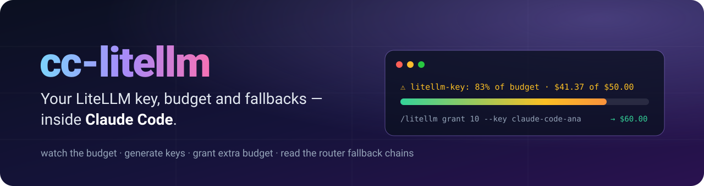
</p>

<p align="center">
  <a href="#install"></a>
  
  
  
  
</p>

<p align="center">
  <a href="../../README.md">English</a> ·
  <a href="README.pt-BR.md">Português</a> ·
  <a href="README.es.md">Español</a> ·
  <a href="README.fr.md">Français</a> ·
  <a href="README.ja.md">日本語</a> ·
  <a href="README.it.md">Italiano</a> ·
  <a href="README.zh-CN.md">简体中文</a> ·
  <a href="README.de.md">Deutsch</a> ·
  <a href="README.ru.md">Русский</a> ·
  <a href="README.tr.md">Türkçe</a> ·
  <b>हिन्दी</b>
</p>

> यह [अंग्रेज़ी README](../../README.md) का हिन्दी अनुवाद है। दोनों में कोई अंतर हो तो अंग्रेज़ी संस्करण ही संदर्भ (reference) माना जाए।

# cc-litellm

यह उन लोगों के लिए एक [Claude Code](https://code.claude.com) plugin है जो अपने models तक **[LiteLLM](https://docs.litellm.ai) proxy** के ज़रिए पहुँचते हैं। यह दिखाता है कि Claude Code जिस **virtual key** का इस्तेमाल कर रहा है, उसके बारे में proxy क्या जानता है (budget, spend, limits, expiry, models, 7-day usage), और admins को terminal छोड़े बिना **keys बनाने, किसी को extra budget देने, किसी key को block करने और router की fallback chains पढ़ने** की सुविधा देता है।

यह repository एक plugin marketplace (`cc-litellm`) है, जिसमें एक ही plugin है: [`litellm-key`](../../plugins/litellm-key)।

<p align="center">
  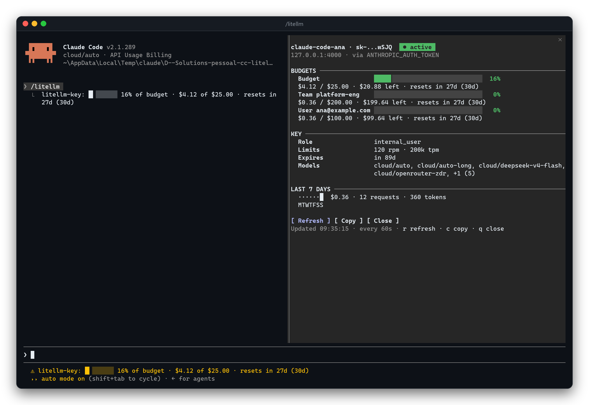
</p>

## आपको क्या मिलता है

| | | |
| --- | --- | --- |
| 👀 **निगरानी** | **Status line** prompt के नीचे, हमेशा दिखती है | `⚠ litellm-key: 86% of budget · $30.00 of $35.00 · resets in 27d (30d)` |
| | **`/litellm` pane** | key, team और user budgets के meters, user का **role**, limits, expiry, models, 7-day sparkline; अपने आप refresh होता है |
| | **Toasts** | 80% (configurable), 95% और 100% पर; key की expiry नज़दीक होने पर; key के blocked या expired होने पर। हर budget window में सिर्फ़ एक बार, अलग-अलग sessions में भी |
| | **Over-budget banner** | prompt के ऊपर एक लाल band जो **जब तक कोई budget पूरी तरह खर्च हो चुका है तब तक बना रहता है** (key, user, team, window या model) और numbers सामान्य होने पर ही हटता है |
| 🛠️ **प्रबंधन** *(admin)* | **`/litellm key new`** | virtual key बनाएँ; secret आपके **clipboard** में जाता है, **transcript में कभी नहीं** |
| | **`/litellm grant`** | किसी key, user या team के लिए extra budget, preview और confirmation के साथ |
| | **`/litellm key block`** / `unblock` | एक ही line में key को रोकें (या वापस चालू करें) |
| | **`/litellm keys`** | keys की list: आपकी अपनी, किसी user की, किसी team की, या सभी |
| | **`/litellm fallbacks`** | router की fallback chains (`cloud/auto → cloud/auto-long → …`), साथ में context-window fallbacks |

हर बदलाव पहले **preview** दिखाता है, Claude Code के **native dialog** में पूछता है, apply करता है, और फिर proxy से **नतीजा वापस पढ़ता है**।

<a id="install"></a>

## Install करें

Recent Claude Code चाहिए: plugin function hooks (एक early-access API) इस्तेमाल करता है, 2.1.289 पर tested।

```text
/plugin marketplace add juninmd/cc-litellm
/plugin install litellm-key@cc-litellm
```

Install किए बिना clone से आज़माएँ: `claude --plugin-dir ./plugins/litellm-key`।

अगर Claude Code पहले से LiteLLM से बात कर रहा है, तो **कुछ configure करने की ज़रूरत नहीं**: plugin वही URL और key पढ़ता है जो Claude Code इस्तेमाल करता है। Admin commands को `litellm_admin_key` भी चाहिए ([Admin कमांड्स](#admin-commands) देखें)।

## एक झलक

### Budget पर नज़र रखें

<p align="center">
  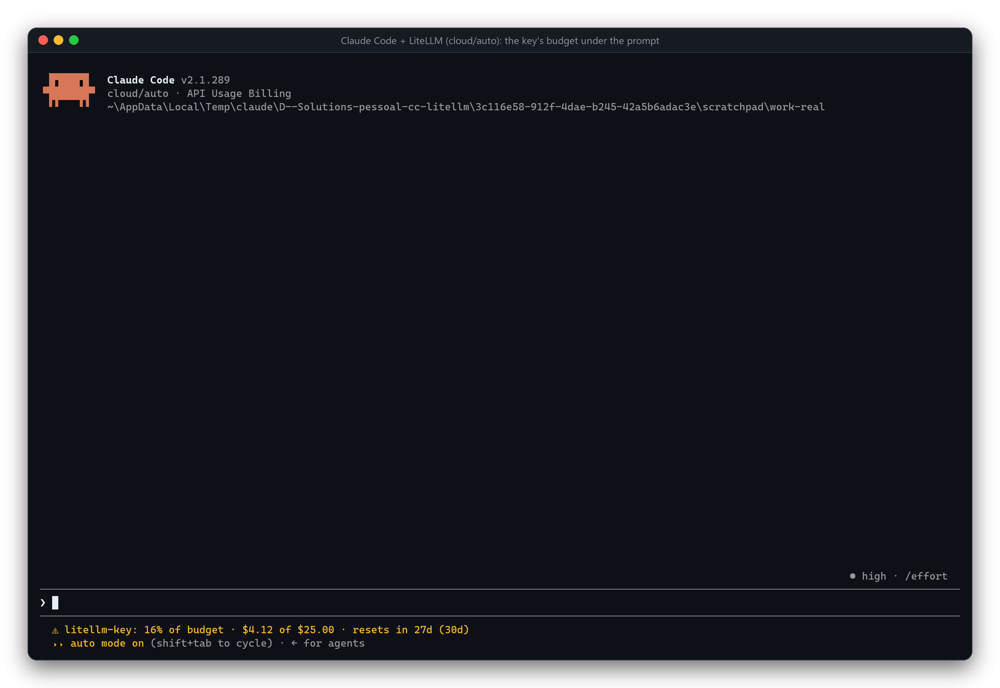
</p>

`/litellm models` बताता है कि key किन models को call कर सकती है, और `/litellm keys` आपकी अपनी keys:

<p align="center">
  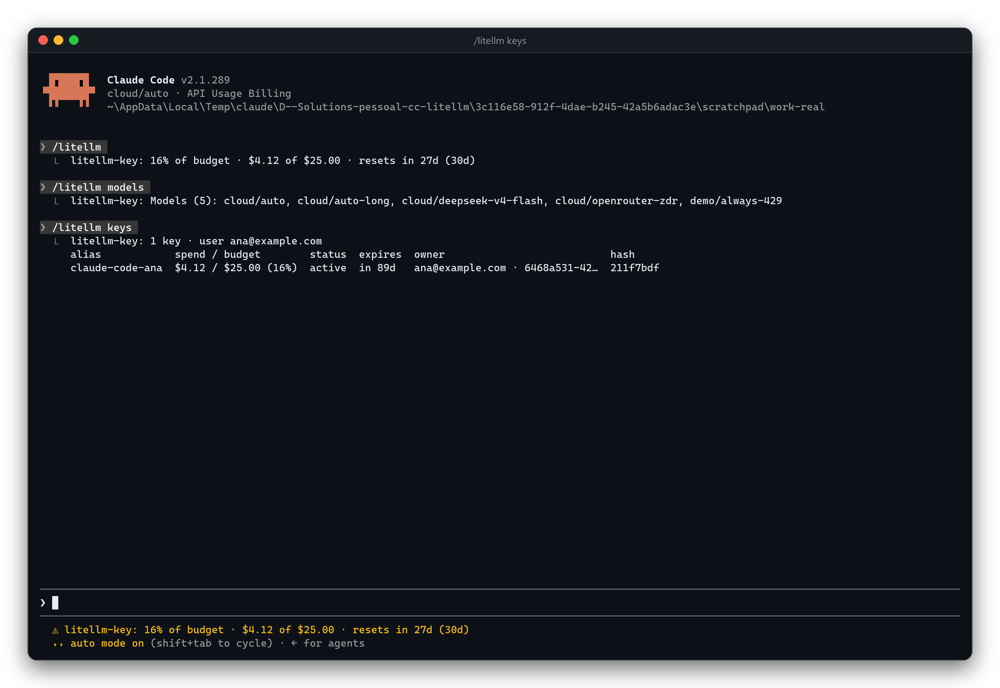
</p>

### गड़बड़ी जल्दी पकड़ें, और उसका सही नाम बताएँ

Plugin एक सामान्य *401* दिखाने की बजाय blocked key, expired key और ग़लत key में फ़र्क़ करके बताता है:

<table>
  <tr>
    <td width="50%">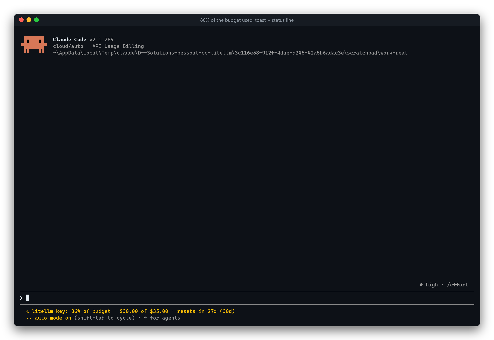<br><sub><b>86%</b>: warning toast और status line</sub></td>
    <td width="50%">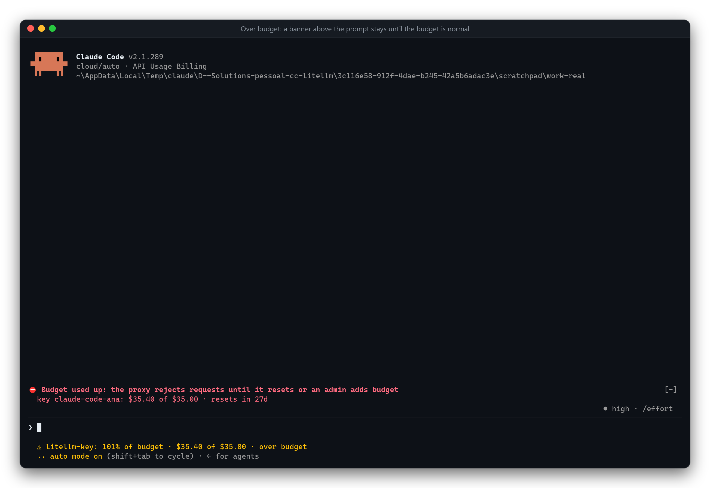<br><sub><b>Over budget</b>: एक banner जो budget सामान्य होने तक बना रहता है</sub></td>
  </tr>
  <tr>
    <td width="50%">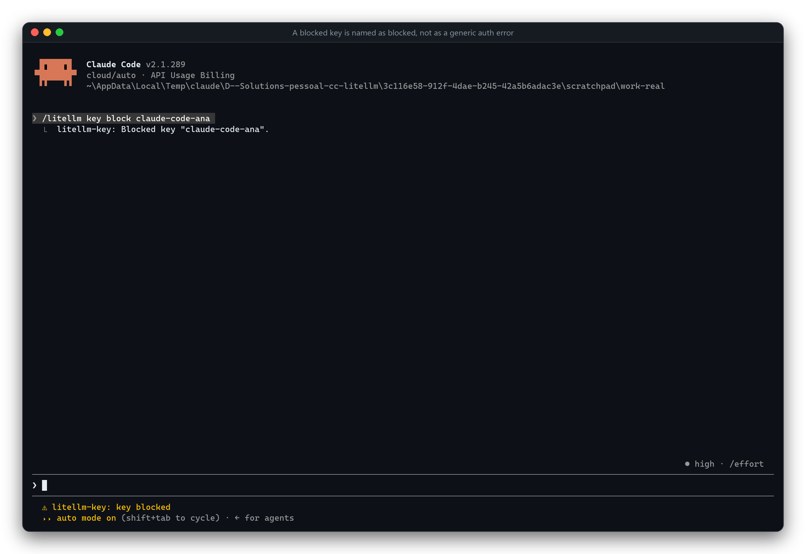<br><sub><b>Blocked</b> key, साफ़ तौर पर blocked बताई गई</sub></td>
    <td width="50%">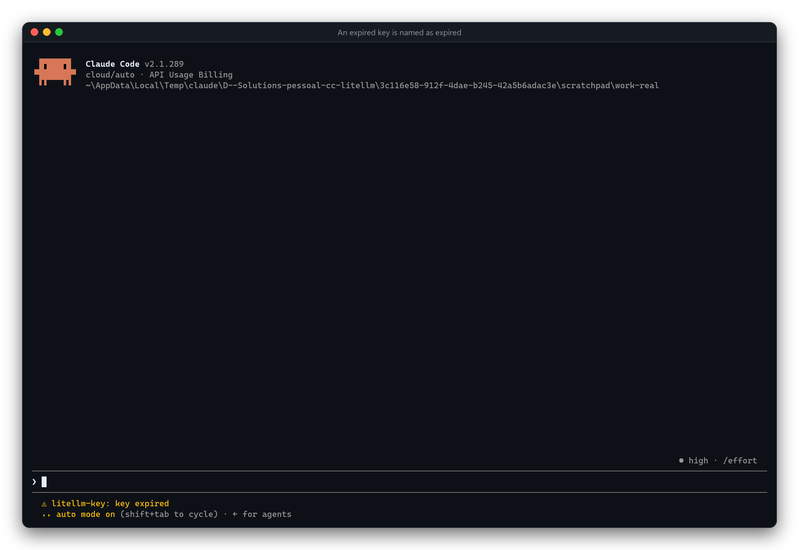<br><sub><b>Expired</b> key, साफ़ तौर पर expired बताई गई</sub></td>
  </tr>
</table>

### Key बनाएँ

<table>
  <tr>
    <td width="50%">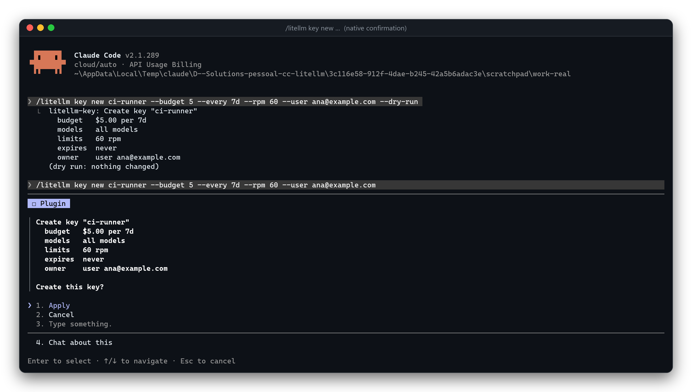<br><sub>पहले preview, फिर Claude Code का native confirmation</sub></td>
    <td width="50%">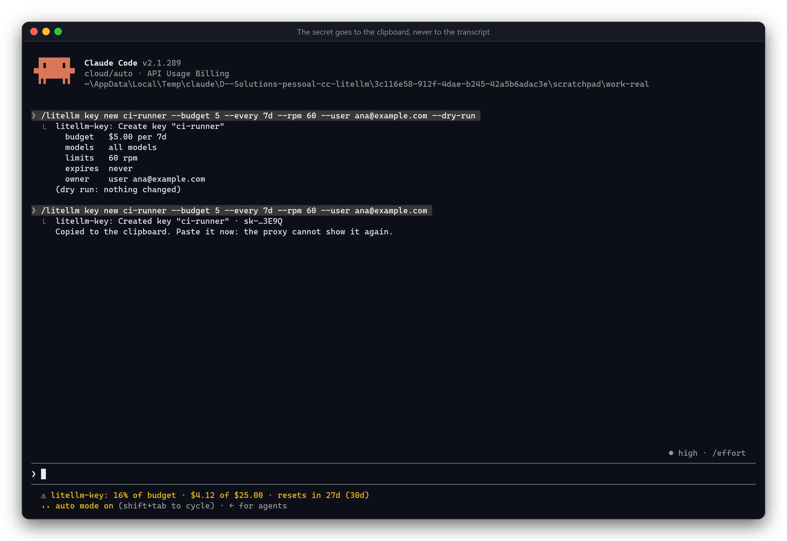<br><sub>Secret clipboard में जाता है। Transcript में सिर्फ़ <code>sk-…9FKg</code> दिखता है</sub></td>
  </tr>
</table>

### Extra budget दें

<table>
  <tr>
    <td width="50%">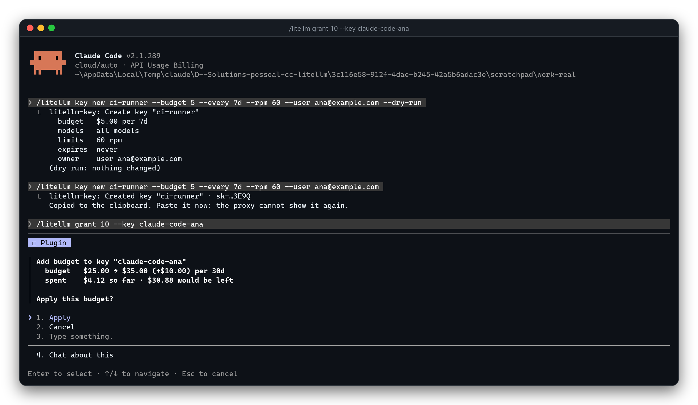<br><sub><code>$25 → $35 (+$10)</code>, कितना खर्च हो चुका है, और कितना बचेगा</sub></td>
    <td width="50%">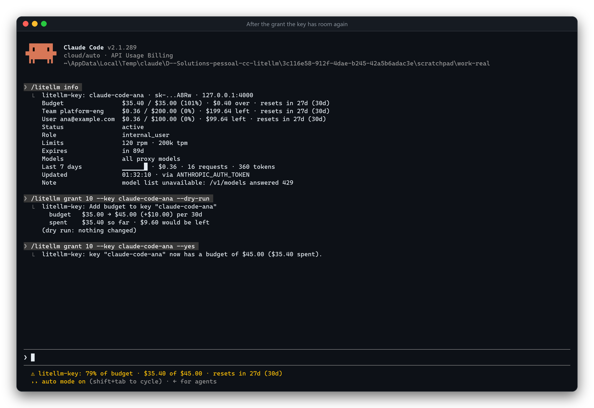<br><sub>Apply हुआ और वापस पढ़ा गया; status line भी उसी के साथ बदलती है (101% → 79%)</sub></td>
  </tr>
</table>

### Fallback chains पढ़ें

<p align="center">
  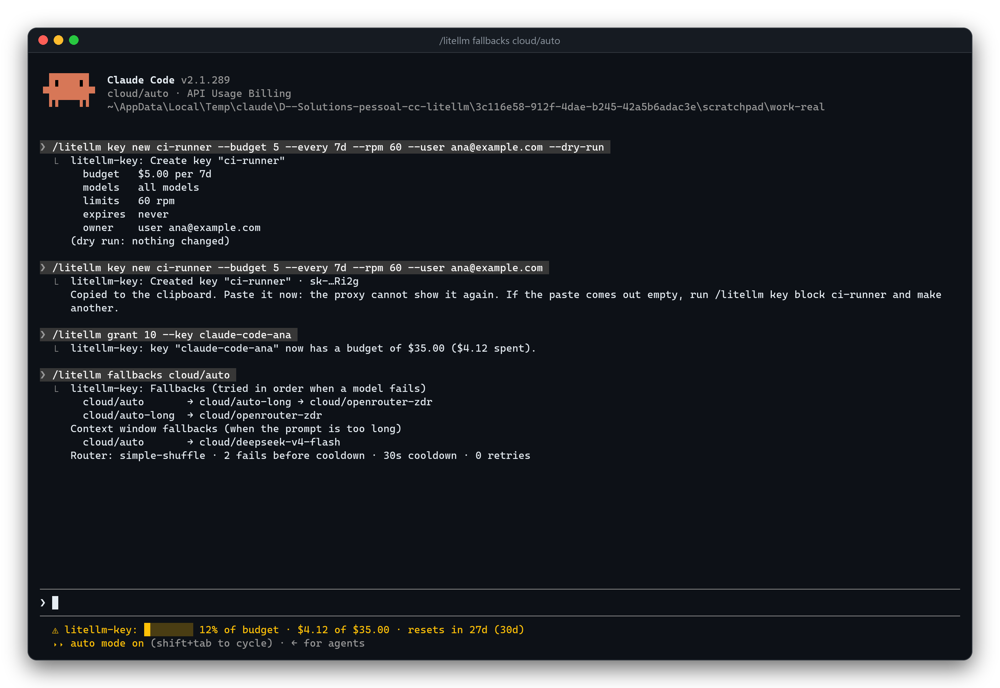
</p>

### और proxy भी यही कहता है

ऊपर जो कुछ भी दिखा, वह असली LiteLLM v1.99.1 का admin UI है, जो दिखा रहा है कि plugin ने क्या किया:

<table>
  <tr>
    <td width="50%">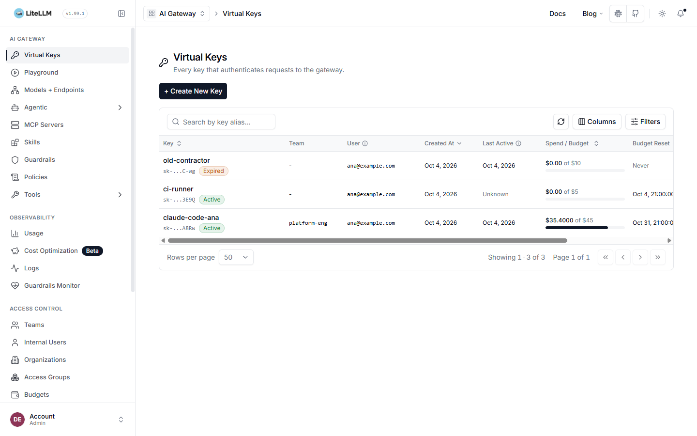<br><sub>Claude Code से बनाई और बढ़ाई गई keys; एक expired है</sub></td>
    <td width="50%">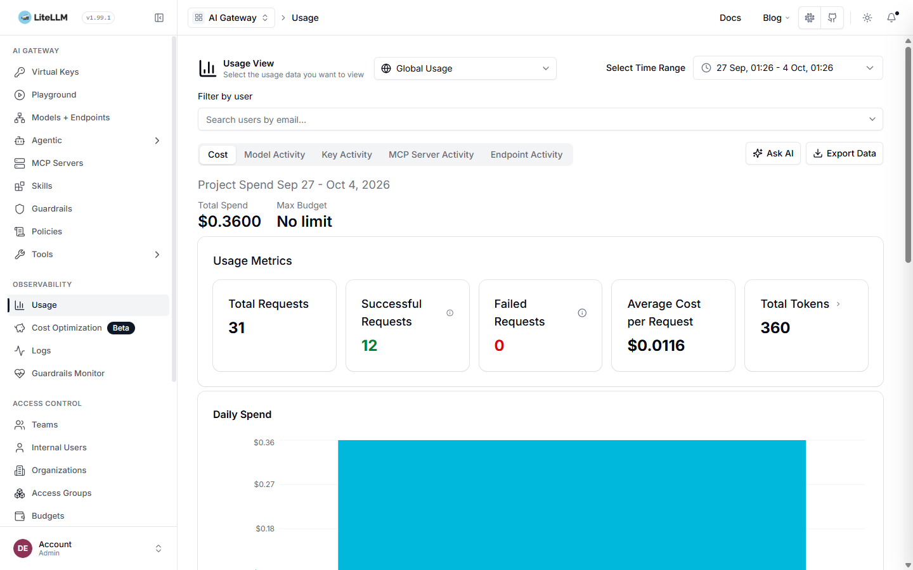<br><sub>Spend Usage में दिखता है</sub></td>
  </tr>
  <tr>
    <td width="50%">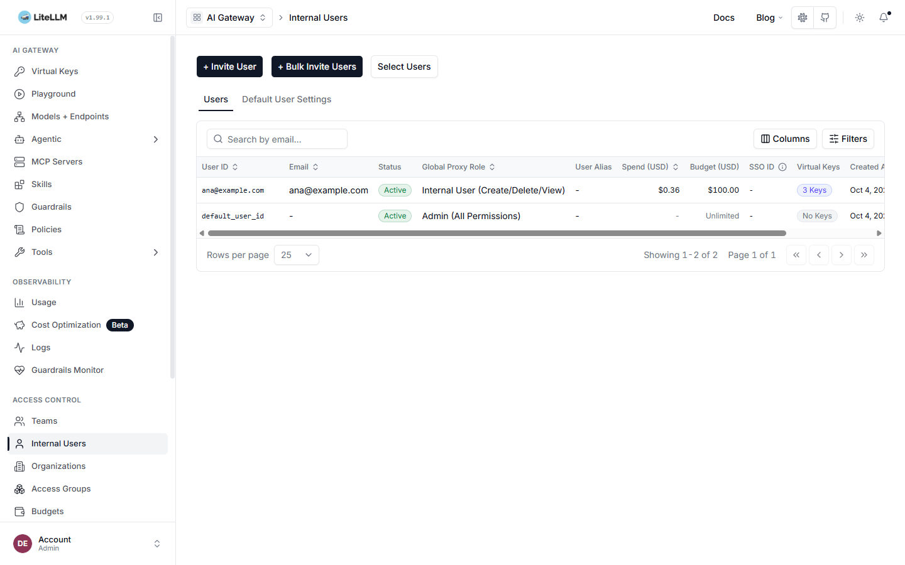<br><sub>User का proxy role (<code>internal_user</code>, <code>proxy_admin</code>) वही है जो pane की <b>Role</b> line दिखाती है</sub></td>
    <td width="50%"></td>
  </tr>
</table>

## कमांड्स

| कमांड | क्या करता है |
| --- | --- |
| `/litellm` | Pane खोलता है (और एक line का summary देता है)। Screen न हो तो: summary print करता है। |
| `/litellm refresh` | अभी दोबारा पढ़ता है। |
| `/litellm info` | पूरा summary transcript में print करता है। |
| `/litellm models` | इस key से call हो सकने वाले models की list। |
| `/litellm debug` | दिखाता है कि URL और keys कहाँ से आ रही हैं (हमेशा masked), क्या-क्या आज़माया गया और नतीजा क्या रहा। |
| `/litellm close` | Pane बंद करता है। |
| `/litellm keys [--user ID \| --team ID \| --all]` | Keys की list। Default: आपके अपने user की keys। 🔐 |
| `/litellm key new <alias> [flags]` | Key बनाता है। 🔐 |
| `/litellm key block <alias\|hash>` / `unblock` | Key को block करता है या वापस चालू करता है। 🔐 |
| `/litellm grant <amount> [--key \| --user \| --team] [--set]` | Budget जोड़ता है। 🔐 |
| `/litellm fallbacks [model]` | Router की fallback chains, चाहें तो नाम से मेल खाने वाले models के लिए। 🔐 |

🔐 = admin command, नीचे देखें। Pane में (click से या `ctrl+x` `tab` से focus करें): `r` refresh करता है, `c` summary copy करता है, `q` बंद करता है, arrow keys से scroll होता है। खाली prompt पर `Esc` भी इसे बंद कर देता है।

Pane उपलब्ध जगह के हिसाब से ढल जाता है: conversation के बगल में (full screen, 110 columns से) हर meter दो lines लेता है; prompt के ऊपर, 122 columns से, meters एक table बन जाते हैं; और संकरे terminals में यह हर meter के लिए दो lines ही रखता है, या `compact_pane` enable करने पर **compact** हो जाता है। Conversation के बगल में pane में titles वाले sections (`BUDGETS`, `KEY`, `LAST 7 DAYS`) दिखते हैं और हफ़्ते के हर दिन के नीचे एक letter होता है। Color कभी अकेला signal नहीं होता: `▲` उस budget को दिखाता है जो अपनी cap के क़रीब है, `✖` उसे जो पूरी तरह खर्च हो चुका है, और बिना spend वाला दिन `·` होता है, कभी छोटा bar नहीं।

<p align="center">
  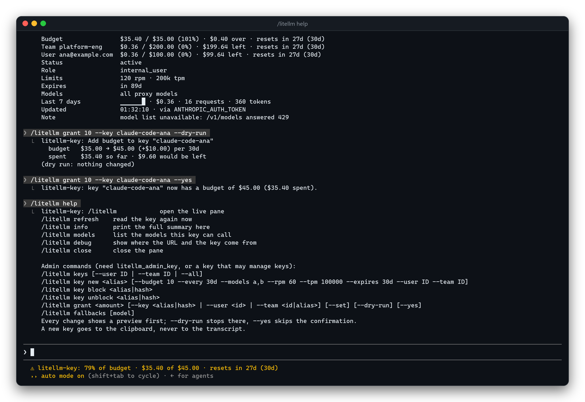
</p>

<a id="admin-commands"></a>

## Admin कमांड्स

Keys को पढ़ने और बदलने के लिए proxy admin होना ज़रूरी है। **`litellm_admin_key`** option set करें (यह आपके OS credential store में रखी जाती है, `settings.json` में कभी नहीं)। इसके बिना plugin आपकी virtual key से कोशिश करता है और अगर proxy मना कर दे, तो आपको ठीक यही बता देता है।

```text
/litellm key new ci-runner --budget 5 --every 7d --rpm 60 --user ana@example.com
/litellm key new batch --budget 20 --models cloud/auto,cloud/auto-long --expires 30d --team platform-eng
/litellm grant 10 --key claude-code-ana          # +$10 on top of the current budget
/litellm grant 200 --team platform-eng --set     # cap the team at exactly $200
/litellm key block old-contractor
/litellm fallbacks cloud/auto
```

| `key new` flag | मतलब |
| --- | --- |
| `--budget 10` | Spend की सीमा, dollars में। |
| `--every 30d` | Budget window: हर 30 दिन में reset होता है (`s m h d w mo`)। |
| `--soft 8` | Soft alert threshold। |
| `--models a,b` | वे models जिन्हें key call कर सकती है (default: सभी)। |
| `--rpm 60` / `--tpm 100000` / `--parallel 4` | Rate limits। |
| `--expires 30d` | इतने समय बाद key काम करना बंद कर देती है। |
| `--user ID` / `--team ID` | Key का मालिक कौन है (और किसका budget भी लागू होता है)। |

हर admin command पर लागू सुरक्षा नियम:

- **पहले preview।** `--dry-run` वहीं रुक जाता है; `--yes` confirmation छोड़ देता है; वरना Claude Code का native dialog पूछता है (**Apply** / **Cancel**)।
- **Read-back।** Grant के बाद plugin proxy से budget दोबारा पढ़ता है और वह बताता है जो वहाँ *मौजूद है*, वह नहीं जो उसने भेजा था।
- **नया secret transcript में कभी नहीं आता।** वह clipboard में जाता है। अगर clipboard उसे नहीं ले पाता, तो key को **वापस delete** कर दिया जाता है (rollback), बजाय इसके कि उसे ऐसी हालत में छोड़ा जाए जहाँ पढ़ा ही न जा सके। `--reveal` उसे print करता है, इस चेतावनी के साथ कि अब वह transcript में save हो चुका है।
- **Raw `sk-…` values को key reference के रूप में refuse किया जाता है:** alias या key hash इस्तेमाल करें। Unknown flags error हैं, चुपचाप ignore नहीं होते।
- **सही आँकड़े।** `grant` बताता है जब spend पहले से नए budget से ज़्यादा हो, जब जोड़ने के लिए कोई cap ही न हो (`--set` इस्तेमाल करें), जब कुछ बदलेगा ही नहीं, और जब `--user` ऐसा user बना देगा जिसे proxy ने पहले कभी देखा ही नहीं।
- **Admin key** सिर्फ़ उसी proxy को भेजी जाती है जो आपके session की अपनी key पहले ही accept कर चुका हो, और कभी print नहीं होती (errors में redact की जाती है)।

आज LiteLLM v1.99.1 पर extra budget के रूप में *क्या* दिया जा सकता है: **key** का budget, **user** का budget, या **team** का budget (`--team`, जिसके लिए proxy admin चाहिए) बढ़ाना, increment के रूप में या absolute value (`--set`) के रूप में। *अस्थायी* budget बढ़ोतरी (`temp_budget_increase`) और per-model budgets proxy की तरफ़ से सिर्फ़ enterprise में हैं ([Budgets](#budgets-what-litellm-can-and-cannot-do) देखें), इसलिए plugin इन्हें दिखावा करने की बजाय offer ही नहीं करता।

<a id="budgets-what-litellm-can-and-cannot-do"></a>

## Budgets: LiteLLM क्या कर सकता है और क्या नहीं

LiteLLM v1.99.1 (open-source proxy, बिना license) पर live जाँचा गया:

| Budget | काम करता है? | कैसे |
| --- | --- | --- |
| **Key** के हिसाब से (cap + reset window) | ✅ | `/litellm key new --budget 10 --every 30d`; बढ़ाने के लिए `/litellm grant 5 --key NAME` |
| **User** के हिसाब से | ✅ | `/litellm grant 5 --user ID` (user की हर key पर लागू होता है) |
| **Team** के हिसाब से | ✅ | `/litellm grant 50 --team NAME` (proxy admin चाहिए) |
| एक key पर कई windows (`budget_limits`, जैसे $5/hour + $50/month) | सिर्फ़ पढ़ने के लिए | proxy में हों तो `Window 1h` meters के रूप में दिखते हैं |
| Key पर **model** के हिसाब से (`model_max_budget`) | ⛔ enterprise | proxy जवाब देता है *"You must have an enterprise license to set model_max_budget"*, `/budget/new` के लिए भी। अगर आपके proxy में license है, तो pane वे meters दिखाता है (`Model gpt-4o`) |
| Temporary budget increase (`temp_budget_increase`) | ⛔ enterprise | open-source proxy यह field accept कर लेता है और उसे कभी लागू (enforce) नहीं करता |

**License के बिना per-model budget:** हर model के लिए एक अलग key बनाएँ, हर एक का अपना cap हो, जैसे
`/litellm key new auto-only --models cloud/auto --budget 5 --every 30d`। वह key सिर्फ़ उसी model को call कर सकती है और $5 पर रुक जाती है।

## कॉन्फ़िगरेशन

Plugin वही URL और key पढ़ता है जो Claude Code इस्तेमाल करता है, इस क्रम में (पहले process variables, फिर `settings.json` का `env` block):

| क्या | कहाँ से |
| --- | --- |
| URL | option `litellm_url`, `ANTHROPIC_BASE_URL`, `LITELLM_PROXY_API_BASE` |
| Key | option `litellm_key`, `ANTHROPIC_CUSTOM_HEADERS` में `x-litellm-api-key` header, `ANTHROPIC_AUTH_TOKEN`, `ANTHROPIC_API_KEY`, `LITELLM_PROXY_API_KEY` |

अगर URL किसी pass-through route पर ख़त्म होता है (`/anthropic`, `/bedrock`, `/v1`…), तो plugin proxy root भी आज़माता है। Key सिर्फ़ उसी URL के साथ इस्तेमाल होती है जिसकी वह है: environment की keys कभी किसी दूसरे host के `litellm_url` पर नहीं जातीं, और `LITELLM_PROXY_API_BASE` सिर्फ़ `LITELLM_PROXY_API_KEY` के साथ जोड़ी जाती है।

सभी options optional हैं (install के समय Claude Code कहता है कि वे "not set" हैं; इसमें कोई हर्ज नहीं)। इन्हें `/plugin configure litellm-key@cc-litellm` से बदलें, या `claude plugin configure litellm-key@cc-litellm --values-stdin` से, जिसमें strings का एक JSON object दें।

| Option | Default | किसलिए |
| --- | --- | --- |
| `litellm_url` | खाली | Default जगह पर न होने वाला proxy (LiteLLM के ज़रिए Bedrock/Vertex, prefix वाला URL)। |
| `litellm_key` | खाली | कोई explicit key। 🔒 credential store में रखी जाती है, `settings.json` में नहीं। |
| `litellm_admin_key` | खाली | `keys`, `key new/block/unblock`, `grant`, `fallbacks` के लिए admin key। 🔒 वही storage। कभी print नहीं होती। |
| `refresh_seconds` | 60 | पढ़ने का interval (15 से 3600)। हर turn के बाद भी पढ़ता है, ज़्यादा से ज़्यादा हर 20 s में। |
| `warn_percent` | 80 | पहली budget warning (95% और 100% पर भी warn करता है)। |
| `show_status_line` | yes | Prompt के नीचे की line। |
| `show_related` | yes | `/user/info` और `/team/info` पढ़ें: वे budgets भी requests को block कर सकते हैं। |
| `show_usage` | yes | 7-day usage के लिए `/user/daily/activity` (LiteLLM का एक beta endpoint) पढ़ें। |
| `compact_pane` | no | संकरे terminals (74 से 121 columns) में prompt के ऊपर compact pane: हर line पर एक meter, facts अगल-बगल। |

## डेटा कहाँ से आता है

**Watching** सिर्फ़ पढ़ता है (`GET`), हमेशा आपकी अपनी key से:

| Endpoint | किसलिए |
| --- | --- |
| `/key/info` | Alias, spend, budget और windows, reset, limits, expiry, status, models, per-model budgets। हर read पर। |
| `/user/info`, `/team/info` | Key के user और team का budget, जब cap लगा हो। हर read पर। |
| `/v1/models` | वे models जो वाकई allowed हैं। हर 10 मिनट में। |
| `/user/daily/activity` | पिछले 7 दिनों का spend, requests और tokens। हर 10 मिनट में। |

**Managing** तभी होता है जब आप कोई admin command टाइप करते हैं: `GET /key/list`, `/key/info`, `/user/info`, `/team/info`, `/v2/team/list`, `/router/settings`, और `POST /key/generate`, `/key/delete` (सिर्फ़ rollback के लिए), `/key/block`, `/key/unblock`, `/key/update`, `/user/update`, `/team/update`।

हर request ज़्यादा से ज़्यादा 4 s इंतज़ार करती है (admin commands के लिए 15 s)। कोई optional read fail हो जाए (403, 404…) तो वह pane में एक शांत note बन जाता है, error नहीं। अगर proxy down हो जाए, तो pane आख़िरी सही reading रखता है, उस पर stale का निशान लगाकर। LiteLLM spend को batches में अपने database में लिखता है, इसलिए numbers एक request से लगभग 10 seconds पीछे रहते हैं।

## प्राइवेसी और सिक्योरिटी

- आपकी key सिर्फ़ उसी proxy तक जाती है जिसे Claude Code पहले से इस्तेमाल करता है, `Authorization` (या `x-litellm-api-key`) header में। किसी URL, log, toast, state या plugin के storage में कभी नहीं; error messages एक filter से गुज़रते हैं जो उसे mask कर देता है।
- Admin key सिर्फ़ उसी proxy root को भेजी जाती है जो आपकी session key पहले ही accept कर चुका हो, और सिर्फ़ तब जब आप कोई admin command टाइप करें।
- Plugin सिर्फ़ उन warnings के ids रखता है जो वह पहले दिखा चुका है, ताकि उन्हें दोहराए नहीं।
- `litellm-key` ये चीज़ें पढ़ता है: `ANTHROPIC_BASE_URL`, `ANTHROPIC_AUTH_TOKEN`, `ANTHROPIC_API_KEY`, `ANTHROPIC_CUSTOM_HEADERS`, `LITELLM_PROXY_API_BASE` और `LITELLM_PROXY_API_KEY`, साथ ही `settings.json` का `env` block, और HTTP requests करता है। `claude plugin validate plugins/litellm-key` यह सब list कर देता है।

## अगर कुछ दिखाई न दे

| लक्षण | संभावित कारण |
| --- | --- |
| Status line में कुछ नहीं, toast कहता है "not configured" | Claude Code किसी proxy के पीछे नहीं है (`ANTHROPIC_BASE_URL` नहीं है या `api.anthropic.com` है)। |
| "The proxy has no database record for this key" | यह master key है, या सिर्फ़ `config.yaml` वाली key। सिर्फ़ `/key/generate` से बनी keys का data होता है। |
| "The proxy has no database" | Proxy `DATABASE_URL` के बिना चल रहा है: पढ़ने के लिए कोई virtual keys ही नहीं हैं। |
| "does not look like a LiteLLM proxy" | URL किसी और चीज़ की तरफ़ इशारा कर रहा है। `litellm_url` को proxy root पर set करें। |
| "key blocked" / "key expired" | ठीक वही। किसी admin से कहें, या किसी दूसरे session से `/litellm key unblock` चलाएँ। |
| "key rejected (401)" | Invalid key। |
| 7-day history नहीं दिख रही | Key का कोई `user_id` नहीं है, या आपके LiteLLM version में beta endpoint मौजूद नहीं है। |
| Admin command कहता है कि admin key चाहिए | `litellm_admin_key` set करें। |
| Admin command "until the proxy accepts this session's key" पर रुका रहता है | यह by design है: admin key सिर्फ़ उसी proxy को भेजी जाती है जिसने आपकी अपनी key accept की हो। उस key को किसी दूसरे session या LiteLLM UI से ठीक करें। |

`/litellm debug` दिखाता है कि plugin ने क्या resolve किया।

## अपने laptop पर असली LiteLLM के साथ आज़माएँ

`dev/litellm` एक पूरा lab है: Docker में Postgres के साथ LiteLLM v1.99.1, इसलिए virtual keys, budgets और spend असली हैं।

```bash
docker compose -f dev/litellm/docker-compose.yml up -d          # zero provider keys: canned answers
bun dev/litellm/smoke.ts                                         # live homologation of the plugin's own modules
```

- **`config.mock.yaml`** (default) एक असली "auto" setup की नक़ल करता है: weighted `cloud/auto` group, एक fallback chain, एक context-window fallback, और एक model (`demo/always-429`) जो हमेशा fail होता है ताकि router का fallback साफ़ दिखे। कुछ भी आपकी machine से बाहर नहीं जाता।
- **आपके अपने cluster की routing:** `python dev/litellm/from-cluster.py --namespace NS --configmap CM --secret SECRET` आपके proxy का `config.yaml` और **सिर्फ़** उसमें referenced provider variables पढ़ता है (read-only, `kubectl` से), और एक local `config.cluster.yaml` + `.env` लिखता है (git-ignored: इन्हें कभी commit न करें)। फिर `LITELLM_CONFIG=config.cluster.yaml docker compose -f dev/litellm/docker-compose.yml up -d`।
- **`dev/mock-litellm.py`** UI states के लिए एक छोटा नकली proxy है (`--scenario warning|blocked|…`), Docker के बिना।
- **`dev/evidence/`** वह harness है जिसने इस README का हर screenshot लिया: ConPTY में चलता असली Claude Code, PNG में render किया हुआ। [`dev/evidence/README.md`](../../dev/evidence/README.md) देखें।

## डेवलपमेंट

```bash
claude plugin validate .                                # marketplace
claude plugin validate plugins/litellm-key --strict     # plugin
claude plugin test plugins/litellm-key                  # tests (they use Claude Code's engine)
tsc -p plugins/litellm-key                              # types (.claude-plugin/types appears on first load)
```

Plugin का layout: `hooks/register.tsx` अकेली ऐसी file है जो Claude Code के `$` को छूती है; यह injected ports (`hooks/ports.ts`) बनाती है और events, commands, timers और toasts को जोड़ती है। बाक़ी सब plain functions हैं जो उन ports को लेती हैं, इसलिए वे engine boot किए बिना test में चलती हैं। `hooks/session.ts` reading cycle है (config, ticker, queue में लगा forced refresh); `hooks/credentials.ts` और `hooks/settings.ts` key और options resolve करते हैं; `hooks/litellm.ts` proxy को पढ़ता है, `hooks/parsers.ts` और `hooks/json.ts` जवाबों को normalize करते हैं और `hooks/failures.ts` बताता है कि क्या गड़बड़ हुई; `hooks/alerts.ts` तय करता है कि कौन-से toasts दिखें। `hooks/commands.ts` `/litellm` की command table है और `hooks/admin*.ts` admin commands हैं (`admin.ts` proxy के reads, `admin-targets.ts` key, user और team के lookups, `admin-writes.ts` उसके writes, `admin-plan.ts` previews और plans, `admin-link.ts` admin key का proxy से link, `admin-commands.ts` flow, `args.ts` argument parser)। `hooks/exceeded.ts` और `hooks/band.tsx` over-budget banner हैं; `hooks/summary.ts` text बनाता है, `hooks/view.tsx` और `hooks/parts.tsx` pane बनाते हैं (gauge, section titles, status chip, meter rows); `hooks/format.ts` में pure formatters हैं; `types/index.d.ts` state contract है।

## ज्ञात सीमाएँ

- `apiKeyHelper` नहीं पढ़ा जाता (user का command चलाना scope से बाहर है)। `litellm_key` इस्तेमाल करें।
- `/user/daily/activity` LiteLLM में beta है और बदल सकता है।
- Per-model budgets (`model_max_budget`), temporary budget increases और key regeneration proxy की तरफ़ से सिर्फ़ enterprise में हैं, इसलिए इन्हें offer नहीं किया जाता ([Budgets](#budgets-what-litellm-can-and-cannot-do) देखें)।
- Over-budget banner terminal और desktop surfaces पर बनता है (Claude Code band सिर्फ़ वहीं देता है); बाक़ी जगह status line और pane यही बात बताते हैं।
- Status line से पहले का `⚠` Claude Code हर plugin status entry के लिए ख़ुद बनाता है; इसका मतलब यह नहीं कि key मुसीबत में है (यह बात text बताता है)।
- Claude Code का plugin API early-access है और versions के बीच बदल सकता है।

## अन्य भाषाएँ

[English](../../README.md) · [Português (Brasil)](README.pt-BR.md) · [Español](README.es.md) · [Français](README.fr.md) · [日本語](README.ja.md) · [Italiano](README.it.md) · [简体中文](README.zh-CN.md) · [Deutsch](README.de.md) · [Русский](README.ru.md) · [Türkçe](README.tr.md)
