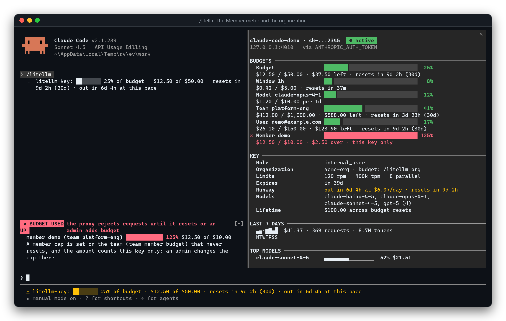
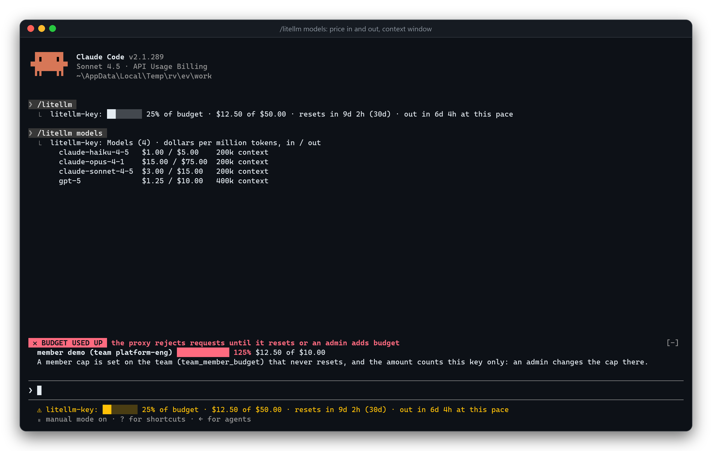

<p align="center">
  
</p>

<p align="center">
  <a href="#install"></a>
  
  
  
  
  
</p>

<p align="center">
  <a href="../../README.md">English</a> ·
  <a href="README.pt-BR.md">Português</a> ·
  <a href="README.es.md">Español</a> ·
  <a href="README.fr.md">Français</a> ·
  <a href="README.ja.md">日本語</a> ·
  <b>Italiano</b> ·
  <a href="README.zh-CN.md">简体中文</a> ·
  <a href="README.de.md">Deutsch</a> ·
  <a href="README.ru.md">Русский</a> ·
  <a href="README.tr.md">Türkçe</a> ·
  <a href="README.hi.md">हिन्दी</a>
</p>

> Questa è una traduzione del README in inglese. Se le due versioni differiscono, fa fede la [versione inglese](../../README.md).

# cc-litellm

Un plugin per [Claude Code](https://code.claude.com) pensato per chi raggiunge i propri modelli tramite un **proxy [LiteLLM](https://docs.litellm.ai)**. Mostra ciò che il proxy sa della **virtual key** che Claude Code sta usando (budget, spesa, limiti, scadenza, modelli, utilizzo degli ultimi 7 giorni) e, per gli admin, permette di **creare e modificare chiavi, assegnare budget extra a qualcuno, bloccare una chiave e leggere le catene di fallback del router** senza uscire dal terminale.

Questo repository è un marketplace di plugin (`cc-litellm`) con un solo plugin: [`litellm-key`](../../plugins/litellm-key).

<p align="center">
  
</p>

## Cosa ottieni

| | | |
| --- | --- | --- |
| 👀 **Monitora** | **Barra di stato** sotto il prompt, sempre visibile | `⚠ litellm-key: 86% of budget · $30.00 of $35.00 · resets in 27d (30d)` |
| | **Pannello `/litellm`** | indicatori per i budget di chiave, team, utente e **membro del team**, il **ruolo** dell'utente, limiti, scadenza, modelli, sparkline a 7 giorni, i **modelli con la spesa maggiore** della settimana e una previsione di **runway**; si aggiorna da solo |
| | **Toast** | all'80% (configurabile), al 95%, al 100%; chiave in scadenza; chiave bloccata o scaduta. Una volta per finestra di budget, anche tra sessioni diverse |
| | **Banner di budget superato** | una fascia rossa sopra il prompt che **resta finché un budget è esaurito** (chiave, utente, team, finestra o modello) e sparisce solo quando i numeri tornano nella norma |
| 🛠️ **Gestisci** *(admin)* | **`/litellm key new`** | crea una virtual key; il segreto va negli **appunti, mai nella trascrizione** |
| | **`/litellm grant`** | budget extra per una chiave, un utente, un team o un'organizzazione, con anteprima e conferma |
| | **`/litellm key set`** / `reset-spend` | modifica modelli, limiti, scadenza o alias di una chiave; azzera il suo contatore di spesa |
| | **`/litellm key block`** / `unblock` | ferma (o ripristina) una chiave con una sola riga |
| | **`/litellm org`** | il budget di un'organizzazione, che una virtual key non può leggere |
| | **`/litellm keys`** | elenca le chiavi: le tue, quelle di un utente, di un team o tutte |
| | **`/litellm fallbacks`** | le catene di fallback del router (`cloud/auto → cloud/auto-long → …`), più i fallback per la finestra di contesto |

Ogni modifica mostra prima un'**anteprima**, chiede conferma nella **finestra di dialogo nativa** di Claude Code, applica e poi **rilegge il risultato** dal proxy.

<a id="install"></a>
## Installazione

Richiede una versione recente di Claude Code: il plugin usa gli hook a funzione (un'API in accesso anticipato), testato su 2.1.289.

```text
/plugin marketplace add juninmd/cc-litellm
/plugin install litellm-key@cc-litellm
```

Provalo da un clone senza installarlo: `claude --plugin-dir ./plugins/litellm-key`.

Se Claude Code parla già con LiteLLM, **non c'è nulla da configurare**: il plugin legge lo stesso URL e la stessa chiave che usa Claude Code. I comandi admin richiedono inoltre `litellm_admin_key` (vedi [Comandi admin](#admin-commands)).

## Un giro guidato

### Tieni d'occhio il budget

<p align="center">
  
</p>

`/litellm models` elenca ciò che la chiave può chiamare, `/litellm keys` le chiavi di cui sei proprietario:

<p align="center">
  
</p>

### Scopri i problemi in tempo, e chiamali col loro nome

Il plugin distingue una chiave bloccata da una scaduta e da una sbagliata, invece di mostrare un generico *401*:

<table>
  <tr>
    <td width="50%"><br><sub><b>86%</b>: toast di avviso e barra di stato</sub></td>
    <td width="50%"><br><sub><b>Budget superato</b>: un banner che resta finché il budget non torna nella norma</sub></td>
  </tr>
  <tr>
    <td width="50%"><br><sub>Chiave <b>bloccata</b>, indicata come bloccata</sub></td>
    <td width="50%"><br><sub>Chiave <b>scaduta</b>, indicata come scaduta</sub></td>
  </tr>
</table>

### Genera una chiave

<table>
  <tr>
    <td width="50%"><br><sub>Anteprima, poi la conferma nativa di Claude Code</sub></td>
    <td width="50%"><br><sub>Il segreto va negli appunti. La trascrizione vede solo <code>sk-…9FKg</code></sub></td>
  </tr>
</table>

### Assegna budget extra

<table>
  <tr>
    <td width="50%"><br><sub><code>$25 → $35 (+$10)</code>, quanto è stato speso, quanto resterebbe</sub></td>
    <td width="50%"><br><sub>Applicato e riletto; la barra di stato segue (101% → 79%)</sub></td>
  </tr>
</table>

### Quando il team limita ogni membro

Un team può limitare quanto spende ogni membro (`team_member_budget`). Il proxy rifiuta la richiesta mentre il budget della chiave è a posto, quindi il plugin legge il tetto e lo mostra come un indicatore `Member`, e il banner di budget superato lo nomina:

<p align="center">
  
</p>

<sub>Acquisito su `dev/mock-litellm.py --scenario member`. Il proxy non comunica a una virtual key il totale di un membro, quindi l'indicatore conta <b>la spesa di questa chiave</b> e lo dice. Può segnare per difetto e, contro un tetto che si azzera, anche per eccesso (un azzeramento riporta a zero la spesa del membro, non quella della chiave), quindi il banner scatta solo per un tetto che non si azzera mai. Anche l'organizzazione della chiave è nominata; il suo budget è solo per admin, <code>/litellm org</code> lo legge.</sub>

### Leggi le catene di fallback

<p align="center">
  
</p>

### Scopri quanto costa un modello

<p align="center">
  
</p>

### E il proxy conferma

Tutto quanto sopra è la vera UI admin di LiteLLM v1.99.1 che riflette ciò che ha fatto il plugin:

<table>
  <tr>
    <td width="50%"><br><sub>Chiavi create e aumentate da Claude Code; una scaduta</sub></td>
    <td width="50%"><br><sub>La spesa compare in Usage</sub></td>
  </tr>
  <tr>
    <td width="50%"><br><sub>Il ruolo dell'utente sul proxy (<code>internal_user</code>, <code>proxy_admin</code>) è ciò che mostra la riga <b>Role</b> del pannello</sub></td>
    <td width="50%"></td>
  </tr>
</table>

## Comandi

| Comando | Cosa fa |
| --- | --- |
| `/litellm` | Apre il pannello (e risponde con un riepilogo di una riga). Senza schermo: stampa il riepilogo. |
| `/litellm refresh` | Rilegge subito. |
| `/litellm info` | Stampa il riepilogo completo nella trascrizione. |
| `/litellm models` | Elenca i modelli che questa chiave può chiamare, con il prezzo per milione di token e la finestra di contesto. |
| `/litellm debug` | Mostra da dove arrivano l'URL e le chiavi (sempre mascherate), cosa è stato provato e il risultato. |
| `/litellm close` | Chiude il pannello. |
| `/litellm keys [--user ID \| --team ID \| --all]` | Elenca le chiavi. Predefinito: le chiavi del tuo utente. 🔐 |
| `/litellm key new <alias> [flags]` | Crea una chiave. 🔐 |
| `/litellm key block <alias\|hash>` / `unblock` | Blocca o ripristina una chiave. 🔐 |
| `/litellm key set <alias\|hash> [flags]` | Modifica modelli, limiti, scadenza o alias di una chiave. 🔐 |
| `/litellm key reset-spend <alias\|hash>` | Riporta a zero il contatore di spesa di una chiave. 🔐 |
| `/litellm grant <amount> [--key \| --user \| --team \| --org] [--set]` | Aggiunge budget. 🔐 |
| `/litellm org [id\|alias]` | Il budget di un'organizzazione; senza nome: l'organizzazione della chiave stessa, altrimenti l'elenco. 🔐 |
| `/litellm fallbacks [model]` | Catene di fallback del router, volendo solo per i modelli che corrispondono a un nome. 🔐 |

🔐 = comando admin, vedi sotto. Nel pannello (dagli il focus con un clic o con `ctrl+x` `tab`): `r` aggiorna, `c` copia il riepilogo, `q` chiude, le frecce scorrono; ogni pulsante indica il proprio tasto (`Refresh (r)`, `Copy (c)`, `Close (q)`). `Esc` lo chiude anche quando il prompt è vuoto.

Il pannello si adatta allo spazio: accanto alla conversazione (a schermo intero, da 110 colonne) ogni indicatore occupa due righe; sopra il prompt, da 122 colonne, gli indicatori diventano una tabella; nei terminali più stretti mantiene due righe per indicatore, oppure diventa **compatto** se attivi `compact_pane`. Accanto alla conversazione il pannello mostra sezioni con titolo (`BUDGETS`, `KEY`, `LAST 7 DAYS`, `TOP MODELS`) e una lettera sotto ogni giorno della settimana; `TOP MODELS` classifica i cinque modelli che hanno speso di più, ciascuno con la sua quota della settimana come barra. Un nome lungo viene tagliato a metà, così `claude-sonnet-4-5` e `claude-sonnet-4-6` restano distinguibili. Il colore non è mai l'unico segnale: `▲` indica un budget vicino al suo tetto, `✖` uno esaurito, e un giorno senza spesa è un `·`, mai una barra corta.

**Runway.** La riga `Runway` (nel pannello e in `/litellm info`) confronta il ritmo degli ultimi 7 giorni (meno giorni per una chiave più recente, mai meno di uno) con il tetto: `lasts until the reset at $2.18/day`, oppure `out in 2d 6h at $2.18/day · resets in 6d 12h` quando il budget si esaurirebbe prima. La barra di stato aggiunge `out in 2d 6h at this pace` solo quando questo sta per accadere: prima del reset, o entro 3 giorni per una chiave senza reset. Una chiave senza tetto, una già esaurita e una il cui reset è scaduto non ricevono alcuna previsione.

<p align="center">
  
</p>

<sub>Acquisito su `dev/mock-litellm.py --scenario warning`: il laboratorio locale non ha una settimana di storico su cui basare la previsione.</sub>

<p align="center">
  
</p>

<a id="admin-commands"></a>
## Comandi admin

Leggere e modificare le chiavi richiede un admin del proxy. Imposta l'opzione **`litellm_admin_key`** (salvata nel credential store del tuo sistema operativo, mai in `settings.json`). Senza, il plugin prova con la tua virtual key e, se il proxy rifiuta, te lo dice esattamente così.

```text
/litellm key new ci-runner --budget 5 --every 7d --rpm 60 --user ana@example.com
/litellm key new batch --budget 20 --models cloud/auto,cloud/auto-long --expires 30d --team platform-eng
/litellm grant 10 --key claude-code-ana          # +$10 on top of the current budget
/litellm grant 200 --team platform-eng --set     # cap the team at exactly $200
/litellm grant 25 --org acme                     # +$25 on the organization (LiteLLM before 1.102, or enterprise)
/litellm key set ci-runner --models cloud/auto --rpm 30 --expires 14d
/litellm key set ci-runner --rpm none --expires never   # none removes a limit; --models all clears the list
/litellm key reset-spend ci-runner               # the budget counter back to $0
/litellm key block old-contractor
/litellm fallbacks cloud/auto
```

| Flag di `key new` | Significato |
| --- | --- |
| `--budget 10` | Tetto di spesa in dollari. |
| `--every 30d` | Finestra di budget: si azzera ogni 30 giorni (`s m h d w mo`). |
| `--soft 8` | Soglia di avviso soft. |
| `--models a,b` | Modelli che la chiave può chiamare (predefinito: tutti). |
| `--rpm 60` / `--tpm 100000` / `--parallel 4` | Rate limit. |
| `--expires 30d` | La chiave smette di funzionare dopo questo intervallo. |
| `--user ID` / `--team ID` | Chi ne è proprietario (e il cui budget si applica a sua volta). |

| Flag di `key set` | Significato |
| --- | --- |
| `--models a,b` / `--models all` | Sostituisce i modelli che la chiave può chiamare (`all`: tutti i modelli). |
| `--rpm N` / `--tpm N` / `--parallel N` | Imposta un limite; `none` lo rimuove. |
| `--expires 30d` / `--expires never` | Scade dopo questo intervallo da adesso, oppure mai. |
| `--alias NEW` | Rinomina la chiave. |

Un campo omesso resta com'è. L'anteprima mostra `before → after` per ogni campo e avvisa quando la chiave è quella che sta usando Claude Code.

Misure di sicurezza, su ogni comando admin:

- **Anteprima prima di tutto.** `--dry-run` si ferma lì; `--yes` salta la conferma; altrimenti chiede la finestra di dialogo nativa di Claude Code (**Apply** / **Cancel**).
- **Rilettura.** Dopo un grant il plugin rilegge il budget dal proxy e riporta ciò che *c'è*, non ciò che ha inviato.
- **Il nuovo segreto non finisce mai nella trascrizione.** Va negli appunti. Se gli appunti non possono riceverlo, la chiave viene **eliminata di nuovo** (rollback) invece di restare illeggibile. `--reveal` la stampa, con un avviso che ora è salvata nella trascrizione.
- **I valori `sk-…` grezzi vengono rifiutati** come riferimenti a una chiave: usa un alias o l'hash della chiave. I flag sconosciuti sono errori, non vengono ignorati in silenzio.
- **Numeri onesti.** `grant` segnala quando la spesa supera già il nuovo budget, quando non c'è un tetto a cui aggiungere (usa `--set`), quando non cambierebbe nulla e quando `--user` creerebbe un utente che il proxy non ha mai visto.
- **L'admin key** viene inviata solo al proxy che ha già accettato la chiave della tua sessione, e non viene mai stampata (gli errori sono oscurati).

Cosa *si può* assegnare oggi come budget extra, su LiteLLM v1.99.1 e v1.104.0: aumentare il budget di una **chiave**, di un **utente** o di un **team** (`--team`, che richiede un admin del proxy), come incremento o come valore assoluto (`--set`). Un budget di **organizzazione** (`--org`) funziona fino alla v1.101; dalla v1.102 il proxy riserva le organizzazioni alle licenze enterprise e il plugin lo dice. Un aumento *temporaneo* del budget (`temp_budget_increase`) e i budget per modello sono solo enterprise lato proxy (vedi [Budget](#budgets-what-litellm-can-and-cannot-do)), quindi il plugin non li offre invece di far finta di niente.

<a id="budgets-what-litellm-can-and-cannot-do"></a>
## Budget: cosa LiteLLM può e non può fare

Verificato dal vivo su LiteLLM v1.99.1 (proxy open source, senza licenza); il tetto per membro e le organizzazioni sono stati verificati anche sulla v1.104.0:

| Budget | Funziona? | Come |
| --- | --- | --- |
| Per **chiave** (tetto + finestra di reset) | ✅ | `/litellm key new --budget 10 --every 30d`; aumenta con `/litellm grant 5 --key NAME` |
| Per **utente** | ✅ | `/litellm grant 5 --user ID` (si applica a ogni chiave di cui l'utente è proprietario) |
| Per **team** | ✅ | `/litellm grant 50 --team NAME` (richiede un admin del proxy) |
| Per **membro** di un team (`team_member_budget`) | 👀 sola lettura | blocca le richieste dell'utente in quel team (HTTP 429, 422 dalla v1.104). Il pannello mostra il tetto come `Member…`; impostalo nella UI o nell'API di LiteLLM. Una virtual key non può leggere il totale del membro, quindi l'indicatore conta la **spesa di questa chiave** e lo dice. Un azzeramento riporta a zero la spesa del membro ma non quella della chiave, quindi il banner di budget superato scatta solo per un tetto che non si azzera mai; contro un tetto che si azzera l'indicatore avverte, non afferma un blocco |
| Per **organizzazione** | ✅ fino alla v1.101 · ⛔ enterprise dalla v1.102 | blocca ogni chiave al suo interno (HTTP 429). Una virtual key non può leggerlo: il pannello nomina l'organizzazione, `/litellm org` mostra il budget (admin), `grant --org` lo aumenta |
| Più finestre su una chiave (`budget_limits`, es. $5/ora + $50/mese) | sola lettura | mostrate come indicatori `Window 1h` quando il proxy le ha |
| Per **modello** su una chiave (`model_max_budget`) | ⛔ enterprise | il proxy risponde *"You must have an enterprise license to set model_max_budget"*, anche per `/budget/new`. Se il tuo proxy ha la licenza, il pannello mostra quegli indicatori (`Model gpt-4o`) |
| Aumento temporaneo del budget (`temp_budget_increase`) | ⛔ enterprise | il proxy open source accetta il campo e non lo applica mai |

**Budget per modello senza licenza:** crea una chiave per ogni modello, ciascuna con il proprio tetto, ad esempio
`/litellm key new auto-only --models cloud/auto --budget 5 --every 30d`. La chiave può chiamare solo quel modello e si ferma a $5.

## Configurazione

Il plugin legge lo stesso URL e la stessa chiave usati da Claude Code, in quest'ordine (prima le variabili di processo, poi il blocco `env` di `settings.json`):

| Cosa | Da dove |
| --- | --- |
| URL | opzione `litellm_url`, `ANTHROPIC_BASE_URL`, `LITELLM_PROXY_API_BASE` |
| Chiave | opzione `litellm_key`, l'header `x-litellm-api-key` in `ANTHROPIC_CUSTOM_HEADERS`, `ANTHROPIC_AUTH_TOKEN`, `ANTHROPIC_API_KEY`, `LITELLM_PROXY_API_KEY` |

Se l'URL termina con una route pass-through (`/anthropic`, `/bedrock`, `/v1`…), il plugin prova anche la root del proxy. Una chiave viene usata solo con l'URL a cui appartiene: le chiavi dell'ambiente non vanno mai a un `litellm_url` su un altro host, e `LITELLM_PROXY_API_BASE` si abbina solo a `LITELLM_PROXY_API_KEY`.

Tutte le opzioni sono facoltative (all'installazione Claude Code dice che sono "not set"; è innocuo). Modificale con `/plugin configure litellm-key@cc-litellm`, oppure con `claude plugin configure litellm-key@cc-litellm --values-stdin` passando un oggetto JSON di stringhe.

| Opzione | Predefinito | A cosa serve |
| --- | --- | --- |
| `litellm_url` | vuoto | Un proxy in una posizione non standard (Bedrock/Vertex tramite LiteLLM, URL con prefisso). |
| `litellm_key` | vuoto | Una chiave esplicita. 🔒 salvata nel credential store, non in `settings.json`. |
| `litellm_admin_key` | vuoto | Admin key per `keys`, `key new/set/reset-spend/block/unblock`, `grant`, `org`, `fallbacks`. 🔒 stessa archiviazione. Mai stampata. |
| `refresh_seconds` | 60 | Intervallo di lettura (da 15 a 3600). Legge anche dopo ogni turno, al massimo ogni 20 s. |
| `warn_percent` | 80 | Primo avviso di budget (avvisa anche al 95% e al 100%). |
| `show_status_line` | sì | La riga sotto il prompt. |
| `show_related` | sì | Legge `/user/info` e `/team/info`: anche quei budget possono bloccare le richieste. |
| `show_usage` | sì | Legge `/user/daily/activity` (un endpoint beta di LiteLLM) per l'utilizzo degli ultimi 7 giorni. |
| `compact_pane` | no | Pannello compatto sopra il prompt nei terminali stretti (da 74 a 121 colonne): un indicatore per riga, informazioni affiancate. |

## Da dove arrivano i dati

Il **monitoraggio** fa solo letture (`GET`), sempre con la tua chiave:

| Endpoint | A cosa serve |
| --- | --- |
| `/key/info` | Alias, spesa, budget e finestre, reset, limiti, scadenza, stato, modelli, budget per modello. A ogni lettura. |
| `/user/info`, `/team/info` | Budget dell'utente e del team della chiave, e il tetto per membro del team, quando hanno un tetto. A ogni lettura. |
| `/v1/models` | I modelli effettivamente consentiti. Ogni 10 min. |
| `/model_group/info` | Prezzo per token e finestra di contesto di quei modelli (il proxy risponde per tutti i suoi modelli; il plugin tiene quelli consentiti). Ogni 10 min. |
| `/user/daily/activity` | Spesa, richieste e token degli ultimi 7 giorni, e la spesa per modello. Ogni 10 min. |

La **gestione** avviene solo quando digiti un comando admin: `GET /key/list`, `/key/info`, `/user/info`, `/team/info`, `/v2/team/list`, `/organization/info`, `/organization/list`, `/router/settings`, e `POST /key/generate`, `/key/delete` (solo per il rollback), `/key/block`, `/key/unblock`, `/key/update`, `/key/{hash}/reset_spend`, `/user/update`, `/team/update`, `PATCH /organization/update`.

Ogni richiesta attende al massimo 4 s (15 s per i comandi admin). Una lettura opzionale che fallisce (403, 404…) diventa una nota discreta nel pannello, mai un errore. Se il proxy va giù, il pannello conserva l'ultima lettura valida, contrassegnata come obsoleta. LiteLLM scrive la spesa nel proprio database a lotti, quindi i numeri sono in ritardo di circa 10 secondi rispetto a una richiesta.

## Privacy e sicurezza

- La tua chiave viaggia solo verso il proxy che Claude Code già usa, nell'header `Authorization` (o `x-litellm-api-key`). Mai in un URL, un log, un toast, nello stato o nell'archiviazione del plugin; i messaggi di errore passano da un filtro che la maschera.
- L'admin key viene inviata solo alla root del proxy che ha già accettato la chiave della tua sessione, e solo quando digiti un comando admin.
- Il plugin memorizza solo gli id degli avvisi già mostrati, per non ripeterli.
- `litellm-key` legge `ANTHROPIC_BASE_URL`, `ANTHROPIC_AUTH_TOKEN`, `ANTHROPIC_API_KEY`, `ANTHROPIC_CUSTOM_HEADERS`, `LITELLM_PROXY_API_BASE` e `LITELLM_PROXY_API_KEY`, il blocco `env` di `settings.json`, ed effettua richieste HTTP. `claude plugin validate plugins/litellm-key` elenca tutto questo.

## Se qualcosa non compare

| Sintomo | Causa probabile |
| --- | --- |
| Niente nella barra di stato, il toast dice "not configured" | Claude Code non è dietro un proxy (`ANTHROPIC_BASE_URL` mancante o `api.anthropic.com`). |
| "The proxy has no database record for this key" | È la master key, oppure una chiave definita solo in `config.yaml`. Solo le chiavi create con `/key/generate` hanno dati. |
| "The proxy has no database" | Il proxy gira senza `DATABASE_URL`: non ci sono virtual key da leggere. |
| "does not look like a LiteLLM proxy" | L'URL punta a qualcos'altro. Imposta `litellm_url` sulla root del proxy. |
| "key blocked" / "key expired" | Esattamente questo. Chiedi a un admin, oppure esegui `/litellm key unblock` da un'altra sessione. |
| "key rejected (401)" | Chiave non valida. |
| Manca lo storico a 7 giorni | La chiave non ha `user_id`, oppure l'endpoint beta non esiste nella tua versione di LiteLLM. |
| Un comando admin dice che serve una admin key | Imposta `litellm_admin_key`. |
| Un comando admin resta in attesa "until the proxy accepts this session's key" | È voluto: l'admin key viene inviata solo a un proxy che ha accettato la tua chiave. Correggi quella chiave da un'altra sessione o dalla UI di LiteLLM. |

`/litellm debug` mostra cosa ha risolto il plugin.

## Provalo con un LiteLLM reale sul tuo laptop

`dev/litellm` è un laboratorio completo: LiteLLM v1.104.0 con Postgres 18 in Docker, quindi virtual key, budget e spesa sono reali. La CI lo avvia ed esegue lo smoke test a ogni modifica.

```bash
docker compose -f dev/litellm/docker-compose.yml up -d          # zero provider keys: canned answers
bun dev/litellm/smoke.ts                                         # live homologation of the plugin's own modules
```

- **`config.mock.yaml`** (quello predefinito) replica una vera configurazione "auto": un gruppo `cloud/auto` pesato, una catena di fallback, un fallback per la finestra di contesto e un modello (`demo/always-429`) che fallisce sempre, così il router passa visibilmente al fallback. Nulla lascia la tua macchina.
- **Il routing del tuo cluster:** `python dev/litellm/from-cluster.py --namespace NS --configmap CM --secret SECRET` legge (in sola lettura, con `kubectl`) il `config.yaml` del tuo proxy e **solo** le variabili dei provider che referenzia, e scrive in locale `config.cluster.yaml` + `.env` (ignorati da git: non committarli mai). Poi `LITELLM_CONFIG=config.cluster.yaml docker compose -f dev/litellm/docker-compose.yml up -d`.
- **`dev/mock-litellm.py`** è un piccolo proxy finto per gli stati della UI (`--scenario warning|blocked|…`), senza Docker.
- **`dev/evidence/`** è l'harness che ha prodotto ogni screenshot di questo README: un vero Claude Code in una ConPTY, renderizzato in PNG. Vedi [`dev/evidence/README.md`](../../dev/evidence/README.md).

## Sviluppo

```bash
claude plugin validate .                                # marketplace
claude plugin validate plugins/litellm-key --strict     # plugin
claude plugin test plugins/litellm-key                  # tests (they use Claude Code's engine)
tsc -p plugins/litellm-key                              # types (.claude-plugin/types appears on first load)
bash dev/check-file-size.sh                             # no source file over 300 lines
```

Struttura del plugin: `hooks/register.tsx` è l'unico file che tocca il `$` di Claude Code; costruisce le porte iniettate (`hooks/ports.ts`) e collega eventi, comandi, timer e toast. Tutto il resto sono funzioni semplici che ricevono quelle porte, quindi girano nei test senza avviare il motore. `hooks/session.ts` è il ciclo di lettura (configurazione, ticker, aggiornamento forzato in coda); `hooks/credentials.ts` e `hooks/settings.ts` risolvono la chiave e le opzioni; `hooks/litellm.ts` legge il proxy, `hooks/parsers.ts` e `hooks/json.ts` normalizzano le risposte e `hooks/failures.ts` dà un nome a ciò che è andato storto; `hooks/alerts.ts` decide i toast. `hooks/commands.ts` è la tabella dei comandi `/litellm` e `hooks/admin*.ts` i comandi admin (`admin.ts` le letture dal proxy, `admin-targets.ts` le ricerche di chiave, utente e team, `admin-writes.ts` le sue scritture, `admin-plan.ts` le anteprime e i piani, `admin-link.ts` il collegamento della chiave admin al proxy, `admin-commands.ts` il flusso, `args.ts` il parser degli argomenti). `hooks/exceeded.ts` e `hooks/band.tsx` sono il banner di budget superato; `hooks/summary.ts` costruisce il testo, `hooks/view.tsx` e `hooks/parts.tsx` il pannello (quadrante, titoli di sezione, chip di stato, righe degli indicatori); `hooks/format.ts` contiene i formatter puri; `types/index.d.ts` è il contratto dello stato.

## Limiti noti

- `apiKeyHelper` non viene letto (eseguire un comando dell'utente è fuori ambito). Usa `litellm_key`.
- `/user/daily/activity` è beta in LiteLLM e potrebbe cambiare.
- I budget per modello (`model_max_budget`), gli aumenti temporanei del budget e la rigenerazione delle chiavi sono solo enterprise lato proxy, quindi non vengono offerti (vedi [Budget](#budgets-what-litellm-can-and-cannot-do)). Modificare le catene di fallback richiede `STORE_MODEL_IN_DB=True` sul proxy, quindi `/litellm fallbacks` resta di sola lettura.
- Il budget di un'**organizzazione** non è nella risposta della chiave stessa e una virtual key potrebbe non poterlo leggere, quindi il pannello si limita a nominare l'organizzazione; `/litellm org` lo legge con una admin key. L'admin key viene comunque inviata solo quando digiti un comando admin, mai sul timer di aggiornamento.
- Il totale di un **membro** del team non viene riportato a una virtual key: l'indicatore `Member` conta solo la spesa di questa chiave, quindi può segnare meno: se l'utente ha più chiavi nel team, il proxy può bloccare prima di quanto indichi l'indicatore. Contro un tetto che si azzera può anche segnare di più (un azzeramento riporta a zero la spesa del membro, non quella della chiave), quindi lì avverte e il banner resta in silenzio.
- La cronologia di 7 giorni legge una pagina delle righe di attività del proxy; quando ce ne sono di più, il pannello avvisa che è parziale.
- Il banner di budget superato viene disegnato sulle superfici terminale e desktop (Claude Code offre la fascia solo lì); sulle altre lo dicono la barra di stato e il pannello.
- Il `⚠` prima della barra di stato è disegnato da Claude Code per ogni voce di stato di un plugin; non significa che la chiave abbia problemi (lo dice il testo).
- L'API dei plugin di Claude Code è in accesso anticipato e può cambiare da una versione all'altra.

## Licenza

[MIT](../../LICENSE).

## Altre lingue

[English](../../README.md) · [Português](README.pt-BR.md) · [Español](README.es.md) · [Français](README.fr.md) · [日本語](README.ja.md) · [简体中文](README.zh-CN.md) · [Deutsch](README.de.md) · [Русский](README.ru.md) · [Türkçe](README.tr.md) · [हिन्दी](README.hi.md)
