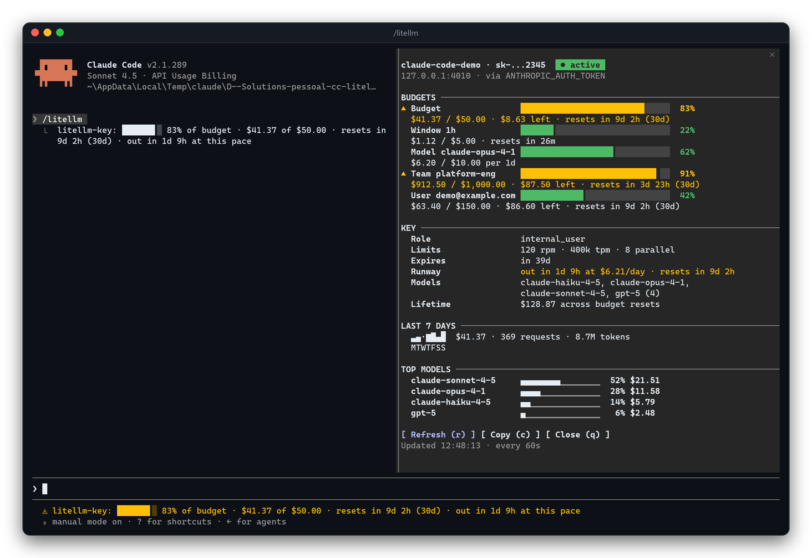

<p align="center">
  
</p>

<p align="center">
  <a href="#install"></a>
  
  
  
  
  
</p>

<p align="center">
  <a href="../../README.md">English</a> ·
  <a href="README.pt-BR.md">Português</a> ·
  <a href="README.es.md">Español</a> ·
  <a href="README.fr.md">Français</a> ·
  <a href="README.ja.md">日本語</a> ·
  <a href="README.it.md">Italiano</a> ·
  <a href="README.zh-CN.md">简体中文</a> ·
  <a href="README.de.md">Deutsch</a> ·
  <a href="README.ru.md">Русский</a> ·
  <b>Türkçe</b> ·
  <a href="README.hi.md">हिन्दी</a>
</p>

> Bu belge, [İngilizce README](../../README.md)'nin çevirisidir. İki sürüm arasında fark olursa referans İngilizce sürümdür.

# cc-litellm

Modellerine bir **[LiteLLM](https://docs.litellm.ai) proxy'si** üzerinden erişenler için bir [Claude Code](https://code.claude.com) eklentisi. Claude Code'un kullandığı **sanal anahtar** hakkında proxy'nin bildiklerini (bütçe, harcama, limitler, son kullanma tarihi, modeller, 7 günlük kullanım) gösterir. Adminler için ise terminalden çıkmadan **anahtar oluşturma, birine ek bütçe verme, bir anahtarı engelleme ve router'ın fallback zincirlerini okuma** imkânı sunar.

Bu depo, tek eklentili bir eklenti marketplace'idir (`cc-litellm`): [`litellm-key`](../../plugins/litellm-key).

<p align="center">
  
</p>

## Neler sunuyor

| | | |
| --- | --- | --- |
| 👀 **İzleyin** | **Durum satırı** prompt'un altında, her zaman görünür | `⚠ litellm-key: 86% of budget · $30.00 of $35.00 · resets in 27d (30d)` |
| | **`/litellm` paneli** | anahtar, takım ve kullanıcı bütçeleri için göstergeler, kullanıcının **rolü**, limitler, son kullanma, modeller, 7 günlük sparkline, haftanın **en çok harcayan modelleri** ve **runway** tahmini; kendini yeniler |
| | **Toast bildirimleri** | %80'de (yapılandırılabilir), %95'te, %100'de; anahtarın süresi dolmak üzere; anahtar engellenmiş veya süresi dolmuş. Bütçe penceresi başına bir kez, oturumlar arasında bile |
| | **Bütçe aşımı banner'ı** | prompt'un üzerinde, **bir bütçe tükendiği sürece ekranda kalan** (anahtar, kullanıcı, takım, pencere veya model) ve yalnızca değerler yeniden normale döndüğünde kalkan kırmızı bir bant |
| 🛠️ **Yönetin** *(admin)* | **`/litellm key new`** | sanal anahtar oluşturur; secret **panonuza gider, transkripte asla** |
| | **`/litellm grant`** | bir anahtar, kullanıcı veya takım için ek bütçe; önizleme ve onay ile |
| | **`/litellm key block`** / `unblock` | bir anahtarı tek satırda durdurur (veya geri açar) |
| | **`/litellm keys`** | anahtarları listeler: sizinkiler, bir kullanıcının, bir takımın veya tümü |
| | **`/litellm fallbacks`** | router'ın fallback zincirleri (`cloud/auto → cloud/auto-long → …`) ve ayrıca context-window fallback'leri |

Her değişiklik önce bir **önizleme** gösterir, Claude Code'un **yerel iletişim kutusunda** onay ister, uygular ve ardından sonucu proxy'den **geri okur**.

<a id="install"></a>

## Kurulum

Güncel bir Claude Code gerekir: eklenti, erken erişim API'si olan function hook'larını kullanır; 2.1.289 üzerinde test edildi.

```text
/plugin marketplace add juninmd/cc-litellm
/plugin install litellm-key@cc-litellm
```

Kurmadan, bir clone üzerinden deneyin: `claude --plugin-dir ./plugins/litellm-key`.

Claude Code zaten LiteLLM ile konuşuyorsa **yapılandıracak bir şey yok**: eklenti, Claude Code'un kullandığı URL'yi ve anahtarı okur. Yönetici komutları ayrıca `litellm_admin_key` ister ([Yönetici komutları](#admin-commands) bölümüne bakın).

## Kısa tur

### Bütçeyi izleyin

<p align="center">
  
</p>

`/litellm models` anahtarın çağırabileceği modelleri, `/litellm keys` ise sahibi olduğunuz anahtarları listeler:

<p align="center">
  
</p>

### Sorunu erkenden yakalayın ve adını koyun

Eklenti, genel bir *401* yerine engellenmiş anahtarı, süresi dolmuş anahtarı ve yanlış anahtarı birbirinden ayırır:

<table>
  <tr>
    <td width="50%"><br><sub><b>%86</b>: uyarı toast'ı ve durum satırı</sub></td>
    <td width="50%"><br><sub><b>Bütçe aşımı</b>: bütçe normale dönene kadar ekranda kalan bir banner</sub></td>
  </tr>
  <tr>
    <td width="50%"><br><sub><b>Engellenmiş</b> anahtar, engellenmiş olarak adlandırılır</sub></td>
    <td width="50%"><br><sub><b>Süresi dolmuş</b> anahtar, süresi dolmuş olarak adlandırılır</sub></td>
  </tr>
</table>

### Anahtar üretin

<table>
  <tr>
    <td width="50%"><br><sub>Önce önizleme, ardından Claude Code'un yerel onayı</sub></td>
    <td width="50%"><br><sub>Secret panoya gider. Transkript yalnızca <code>sk-…9FKg</code> değerini görür</sub></td>
  </tr>
</table>

### Ek bütçe verin

<table>
  <tr>
    <td width="50%"><br><sub><code>$25 → $35 (+$10)</code>, harcanan tutar ve geriye kalacak tutar</sub></td>
    <td width="50%"><br><sub>Uygulandı ve geri okundu; durum satırı da buna uyar (%101 → %79)</sub></td>
  </tr>
</table>

### Fallback zincirlerini okuyun

<p align="center">
  
</p>

### Ve proxy de aynı fikirde

Yukarıdakilerin hepsi, eklentinin yaptıklarını yansıtan gerçek LiteLLM v1.99.1 yönetici arayüzüdür:

<table>
  <tr>
    <td width="50%"><br><sub>Claude Code'dan oluşturulan ve artırılan anahtarlar; biri süresi dolmuş</sub></td>
    <td width="50%"><br><sub>Harcama Usage'da görünür</sub></td>
  </tr>
  <tr>
    <td width="50%"><br><sub>Kullanıcının proxy rolü (<code>internal_user</code>, <code>proxy_admin</code>), panelin <b>Role</b> satırında görünen değerdir</sub></td>
    <td width="50%"></td>
  </tr>
</table>

## Komutlar

| Komut | Ne yapar |
| --- | --- |
| `/litellm` | Paneli açar (ve tek satırlık bir özetle yanıt verir). Ekran yoksa özeti yazdırır. |
| `/litellm refresh` | Şimdi yeniden okur. |
| `/litellm info` | Tam özeti transkripte yazdırır. |
| `/litellm models` | Bu anahtarın çağırabileceği modelleri listeler. |
| `/litellm debug` | URL'nin ve anahtarların nereden geldiğini (her zaman maskeli), nelerin denendiğini ve sonucu gösterir. |
| `/litellm close` | Paneli kapatır. |
| `/litellm keys [--user ID \| --team ID \| --all]` | Anahtarları listeler. Varsayılan: kendi kullanıcınızın anahtarları. 🔐 |
| `/litellm key new <alias> [flags]` | Anahtar oluşturur. 🔐 |
| `/litellm key block <alias\|hash>` / `unblock` | Bir anahtarı engeller veya geri açar. 🔐 |
| `/litellm grant <amount> [--key \| --user \| --team] [--set]` | Bütçe ekler. 🔐 |
| `/litellm fallbacks [model]` | Router fallback zincirleri; isteğe bağlı olarak adı eşleşen modeller için. 🔐 |

🔐 = yönetici komutu, aşağıya bakın. Panelde (tıklayarak veya `ctrl+x` `tab` ile odaklanın): `r` yeniler, `c` özeti kopyalar, `q` kapatır, ok tuşları kaydırır; her düğme kendi tuşunu belirtir (`Refresh (r)`, `Copy (c)`, `Close (q)`). `Esc` de boş bir prompt'ta paneli kapatır.

Panel, mevcut alana uyum sağlar: konuşmanın yanında (tam ekran, 110 sütundan itibaren) her gösterge iki satır kaplar; prompt'un üzerinde, 122 sütundan itibaren göstergeler tabloya dönüşür; daha dar terminallerde gösterge başına iki satırı korur ya da `compact_pane` seçeneğini etkinleştirirseniz **kompakt** hâle gelir. Konuşmanın yanında panel, başlıklı bölümler (`BUDGETS`, `KEY`, `LAST 7 DAYS`, `TOP MODELS`) gösterir ve haftanın her gününün altına bir harf koyar; `TOP MODELS` en çok harcayan beş modeli sıralar, her birinin haftadaki payını bir çubuk olarak gösterir. Uzun bir ad ortadan kısaltılır, böylece `claude-sonnet-4-5` ile `claude-sonnet-4-6` birbirinden ayırt edilebilir kalır. Renk hiçbir zaman tek sinyal değildir: `▲` üst sınırına yaklaşmış bir bütçeyi, `✖` tükenmiş bir bütçeyi işaretler; harcama olmayan gün kısa bir çubuk değil, bir `·` olarak görünür.

**Runway.** `Runway` satırı (panelde ve `/litellm info` içinde) son 7 günün harcama hızını (bundan genç bir anahtar için daha az gün, ama hiçbir zaman birden az değil) üst sınırla karşılaştırır: `lasts until the reset at $2.18/day`, ya da bütçe önce tükenecekse `out in 2d 6h at $2.18/day · resets in 6d 12h`. Durum satırı `out in 2d 6h at this pace` ifadesini yalnızca bu yaklaşıyorsa ekler: sıfırlamadan önce ya da sıfırlaması olmayan bir anahtar için 3 gün içinde. Üst sınırı olmayan bir anahtar, zaten tükenmiş bir anahtar ve sıfırlaması gelmiş bir anahtar için tahmin gösterilmez.

<p align="center">
  
</p>

<sub>`dev/mock-litellm.py --scenario warning` üzerinde çekildi: yerel laboratuvarda tahmin yapılabilecek bir haftalık geçmiş yok.</sub>

<p align="center">
  
</p>

<a id="admin-commands"></a>

## Yönetici komutları

Anahtarları okumak ve değiştirmek için proxy admin yetkisi gerekir. **`litellm_admin_key`** seçeneğini ayarlayın (işletim sisteminizin kimlik bilgisi deposunda saklanır, `settings.json` içinde asla). Bu anahtar olmadan eklenti sanal anahtarınızla dener ve proxy reddederse bunu size açıkça söyler.

```text
/litellm key new ci-runner --budget 5 --every 7d --rpm 60 --user ana@example.com
/litellm key new batch --budget 20 --models cloud/auto,cloud/auto-long --expires 30d --team platform-eng
/litellm grant 10 --key claude-code-ana          # +$10 on top of the current budget
/litellm grant 200 --team platform-eng --set     # cap the team at exactly $200
/litellm key block old-contractor
/litellm fallbacks cloud/auto
```

| `key new` bayrağı | Anlamı |
| --- | --- |
| `--budget 10` | Dolar cinsinden harcama üst sınırı. |
| `--every 30d` | Bütçe penceresi: her 30 günde bir sıfırlanır (`s m h d w mo`). |
| `--soft 8` | Yumuşak uyarı eşiği. |
| `--models a,b` | Anahtarın çağırabileceği modeller (varsayılan: hepsi). |
| `--rpm 60` / `--tpm 100000` / `--parallel 4` | Hız sınırları. |
| `--expires 30d` | Anahtar bu süre sonunda çalışmayı bırakır. |
| `--user ID` / `--team ID` | Sahibi kim (ve kimin bütçesi de geçerli olur). |

Her yönetici komutunda geçerli güvenlik önlemleri:

- **Önce önizleme.** `--dry-run` burada durur; `--yes` onayı atlar; aksi hâlde Claude Code'un yerel iletişim kutusu sorar (**Apply** / **Cancel**).
- **Geri okuma.** Bir grant'ten sonra eklenti bütçeyi proxy'den yeniden okur ve gönderdiğinizi değil, orada *olanı* bildirir.
- **Yeni secret transkripte asla düşmez.** Panoya gider. Pano kabul edemezse anahtar, okunamaz hâlde tutulmak yerine **yeniden silinir** (rollback). `--reveal` anahtarı yazdırır ve artık transkriptte kayıtlı olduğuna dair bir uyarı gösterir.
- **Ham `sk-…` değerleri anahtar referansı olarak reddedilir**: alias veya anahtar hash'i kullanın. Bilinmeyen bayraklar sessizce yok sayılmaz, hata verir.
- **Dürüst rakamlar.** `grant`; harcama yeni bütçeyi zaten aştığında, üzerine eklenecek bir üst sınır olmadığında (`--set` kullanın), hiçbir şeyin değişmeyeceği durumda ve `--user` proxy'nin hiç görmediği bir kullanıcı oluşturacağında bunu söyler.
- **Admin anahtarı** yalnızca oturumunuzun kendi anahtarını zaten kabul etmiş proxy'ye gönderilir ve asla yazdırılmaz (hatalar maskelenir).

LiteLLM v1.99.1'de bugün ek bütçe olarak *verilebilenler*: bir **anahtar** bütçesini, bir **kullanıcı** bütçesini veya bir **takım** bütçesini (`--team`, proxy admin gerektirir) artış olarak ya da mutlak değer olarak (`--set`) yükseltmek. *Geçici* bütçe artışı (`temp_budget_increase`) ve model başına bütçeler proxy tarafında yalnızca enterprise sürümündedir ([Bütçeler](#budgets-what-litellm-can-and-cannot-do) bölümüne bakın); bu yüzden eklenti, varmış gibi davranmak yerine bunları sunmaz.

<a id="budgets-what-litellm-can-and-cannot-do"></a>

## Bütçeler: LiteLLM neleri yapabilir, neleri yapamaz

LiteLLM v1.99.1'e karşı canlı olarak doğrulandı (açık kaynak proxy, lisanssız):

| Bütçe | Çalışıyor mu? | Nasıl |
| --- | --- | --- |
| **Anahtar** başına (üst sınır + sıfırlama penceresi) | ✅ | `/litellm key new --budget 10 --every 30d`; `/litellm grant 5 --key NAME` ile artırın |
| **Kullanıcı** başına | ✅ | `/litellm grant 5 --user ID` (kullanıcının sahip olduğu her anahtar için geçerlidir) |
| **Takım** başına | ✅ | `/litellm grant 50 --team NAME` (proxy admin gerektirir) |
| Bir anahtarda birden çok pencere (`budget_limits`, örn. saatte $5 + ayda $50) | salt okunur | proxy'de varsa `Window 1h` göstergeleri olarak gösterilir |
| Bir anahtarda **model** başına (`model_max_budget`) | ⛔ enterprise | proxy, `/budget/new` için de *"You must have an enterprise license to set model_max_budget"* yanıtını verir. Proxy'nizde lisans varsa panel bu göstergeleri gösterir (`Model gpt-4o`) |
| Geçici bütçe artışı (`temp_budget_increase`) | ⛔ enterprise | açık kaynak proxy alanı kabul eder ama hiçbir zaman uygulamaz |

**Lisans olmadan model başına bütçe:** her model için, kendi üst sınırı olan ayrı bir anahtar oluşturun, örn.
`/litellm key new auto-only --models cloud/auto --budget 5 --every 30d`. Anahtar yalnızca o modeli çağırabilir ve $5'ta durur.

## Yapılandırma

Eklenti, Claude Code'un kullandığı URL'yi ve anahtarı şu sırayla okur (önce süreç değişkenleri, sonra `settings.json` içindeki `env` bloğu):

| Ne | Kaynak |
| --- | --- |
| URL | `litellm_url` seçeneği, `ANTHROPIC_BASE_URL`, `LITELLM_PROXY_API_BASE` |
| Anahtar | `litellm_key` seçeneği, `ANTHROPIC_CUSTOM_HEADERS` içindeki `x-litellm-api-key` header'ı, `ANTHROPIC_AUTH_TOKEN`, `ANTHROPIC_API_KEY`, `LITELLM_PROXY_API_KEY` |

URL bir pass-through rotasıyla bitiyorsa (`/anthropic`, `/bedrock`, `/v1`…), eklenti proxy kökünü de dener. Bir anahtar yalnızca ait olduğu URL ile kullanılır: ortam değişkenlerindeki anahtarlar başka bir host'taki `litellm_url`'e asla gitmez ve `LITELLM_PROXY_API_BASE` yalnızca `LITELLM_PROXY_API_KEY` ile eşleşir.

Tüm seçenekler isteğe bağlıdır (Claude Code kurulumda bunların "ayarlanmadığını" söyler; bu zararsızdır). Bunları `/plugin configure litellm-key@cc-litellm` ile ya da string'lerden oluşan bir JSON nesnesiyle `claude plugin configure litellm-key@cc-litellm --values-stdin` komutuyla değiştirin.

| Seçenek | Varsayılan | Amaç |
| --- | --- | --- |
| `litellm_url` | boş | Varsayılan olmayan bir yerdeki proxy (LiteLLM üzerinden Bedrock/Vertex, önek içeren URL). |
| `litellm_key` | boş | Açıkça belirtilmiş bir anahtar. 🔒 kimlik bilgisi deposunda saklanır, `settings.json` içinde değil. |
| `litellm_admin_key` | boş | `keys`, `key new/block/unblock`, `grant`, `fallbacks` için admin anahtarı. 🔒 aynı depolama. Asla yazdırılmaz. |
| `refresh_seconds` | 60 | Okuma aralığı (15 ila 3600). Her turdan sonra da okur, en fazla 20 sn'de bir. |
| `warn_percent` | 80 | İlk bütçe uyarısı (%95 ve %100'de de uyarır). |
| `show_status_line` | evet | Prompt'un altındaki satır. |
| `show_related` | evet | `/user/info` ve `/team/info` okunur: bu bütçeler de istekleri engelleyebilir. |
| `show_usage` | evet | 7 günlük kullanım için `/user/daily/activity` okunur (beta bir LiteLLM endpoint'i). |
| `compact_pane` | hayır | Dar terminallerde (74 ila 121 sütun) prompt'un üzerinde kompakt panel: satır başına bir gösterge, bilgiler yan yana. |

## Verilerin geldiği yer

**İzleme** yalnızca okur (`GET`), her zaman kendi anahtarınızla:

| Endpoint | Amaç |
| --- | --- |
| `/key/info` | Alias, harcama, bütçe ve pencereler, sıfırlama, limitler, son kullanma, durum, modeller, model başına bütçeler. Her okumada. |
| `/user/info`, `/team/info` | Anahtarın kullanıcısının ve takımının bütçesi (üst sınır varsa). Her okumada. |
| `/v1/models` | Gerçekte izin verilen modeller. 10 dakikada bir. |
| `/user/daily/activity` | Son 7 günün harcaması, istek ve token sayıları, ayrıca model başına harcama. 10 dakikada bir. |

**Yönetim** yalnızca bir yönetici komutu yazdığınızda gerçekleşir: `GET /key/list`, `/key/info`, `/user/info`, `/team/info`, `/v2/team/list`, `/router/settings` ve `POST /key/generate`, `/key/delete` (yalnızca rollback), `/key/block`, `/key/unblock`, `/key/update`, `/user/update`, `/team/update`.

Her istek en fazla 4 sn bekler (yönetici komutlarında 15 sn). Başarısız olan isteğe bağlı bir okuma (403, 404…) panelde sessiz bir nota dönüşür, asla hata olmaz. Proxy çökerse panel son başarılı okumayı eski (stale) olarak işaretleyerek korur. LiteLLM harcamayı veritabanına toplu olarak yazar; bu yüzden rakamlar gerçek harcamanın yaklaşık 10 saniye gerisinde kalır.

## Gizlilik ve güvenlik

- Anahtarınız yalnızca Claude Code'un zaten kullandığı proxy'ye, `Authorization` (veya `x-litellm-api-key`) header'ında gider. Hiçbir zaman bir URL'de, log'da, toast'ta, state'te ya da eklentinin depolamasında yer almaz; hata mesajları onu maskeleyen bir filtreden geçer.
- Admin anahtarı yalnızca oturum anahtarınızı zaten kabul etmiş proxy köküne ve yalnızca bir yönetici komutu yazdığınızda gönderilir.
- Eklenti, tekrarı önlemek için yalnızca daha önce gösterdiği uyarıların kimliklerini saklar.
- `litellm-key`; `ANTHROPIC_BASE_URL`, `ANTHROPIC_AUTH_TOKEN`, `ANTHROPIC_API_KEY`, `ANTHROPIC_CUSTOM_HEADERS`, `LITELLM_PROXY_API_BASE` ve `LITELLM_PROXY_API_KEY` değişkenlerini ile `settings.json` içindeki `env` bloğunu okur ve HTTP istekleri yapar. `claude plugin validate plugins/litellm-key` bunların hepsini listeler.

## Bir şey görünmüyorsa

| Belirti | Olası neden |
| --- | --- |
| Durum satırında hiçbir şey yok, toast "not configured" diyor | Claude Code bir proxy'nin arkasında değil (`ANTHROPIC_BASE_URL` yok veya `api.anthropic.com`). |
| "The proxy has no database record for this key" | Master anahtar ya da yalnızca `config.yaml` içinde tanımlı bir anahtar. Yalnızca `/key/generate` ile oluşturulan anahtarların verisi vardır. |
| "The proxy has no database" | Proxy `DATABASE_URL` olmadan çalışıyor: okunacak sanal anahtar yok. |
| "does not look like a LiteLLM proxy" | URL başka bir şeye işaret ediyor. `litellm_url` değerini proxy köküne ayarlayın. |
| "key blocked" / "key expired" | Tam olarak bu. Bir admin'e danışın ya da başka bir oturumdan `/litellm key unblock` çalıştırın. |
| "key rejected (401)" | Geçersiz anahtar. |
| 7 günlük geçmiş yok | Anahtarın `user_id` değeri yok ya da beta endpoint LiteLLM sürümünüzde bulunmuyor. |
| Yönetici komutu admin anahtarı gerektiğini söylüyor | `litellm_admin_key` ayarlayın. |
| Yönetici komutu "until the proxy accepts this session's key" diye bekliyor | Tasarım gereği, admin anahtarı yalnızca sizin kendi anahtarınızı kabul etmiş bir proxy'ye gönderilir. O anahtarı başka bir oturumdan veya LiteLLM arayüzünden düzeltin. |

`/litellm debug` eklentinin neyi çözümlediğini gösterir.

## Dizüstü bilgisayarınızda gerçek bir LiteLLM ile deneyin

`dev/litellm` eksiksiz bir laboratuvardır: Docker'da Postgres ile LiteLLM v1.99.1; böylece sanal anahtarlar, bütçeler ve harcama gerçektir.

```bash
docker compose -f dev/litellm/docker-compose.yml up -d          # zero provider keys: canned answers
bun dev/litellm/smoke.ts                                         # live homologation of the plugin's own modules
```

- **`config.mock.yaml`** (varsayılan), gerçek bir "auto" kurulumunu yansıtır: ağırlıklı bir `cloud/auto` grubu, bir fallback zinciri, bir context-window fallback'i ve router'ın fallback'e düştüğünü gözle görülür kılan, her zaman başarısız olan bir model (`demo/always-429`). Hiçbir şey makinenizden çıkmaz.
- **Kendi cluster'ınızın routing'i:** `python dev/litellm/from-cluster.py --namespace NS --configmap CM --secret SECRET` komutu, proxy'nizin `config.yaml` dosyasını ve **yalnızca** onun başvurduğu provider değişkenlerini okur (salt okunur, `kubectl`) ve yerel bir `config.cluster.yaml` + `.env` yazar (git-ignored: asla commit etmeyin). Ardından `LITELLM_CONFIG=config.cluster.yaml docker compose -f dev/litellm/docker-compose.yml up -d`.
- **`dev/mock-litellm.py`**, arayüz durumları için (`--scenario warning|blocked|…`) Docker'sız çalışan küçük bir sahte proxy'dir.
- **`dev/evidence/`**, bu README'deki her ekran görüntüsünü alan harness'tir: bir ConPTY içinde gerçek bir Claude Code, PNG olarak render edilmiş. Bkz. [`dev/evidence/README.md`](../../dev/evidence/README.md).

## Geliştirme

```bash
claude plugin validate .                                # marketplace
claude plugin validate plugins/litellm-key --strict     # plugin
claude plugin test plugins/litellm-key                  # tests (they use Claude Code's engine)
tsc -p plugins/litellm-key                              # types (.claude-plugin/types appears on first load)
bash dev/check-file-size.sh                             # no source file over 300 lines
```

Eklentinin yapısı: `hooks/register.tsx`, Claude Code'un `$` nesnesine dokunan tek dosyadır; enjekte edilen portları (`hooks/ports.ts`) oluşturur ve olayları, komutları, zamanlayıcıları ve toast'ları bağlar. Geri kalan her şey bu portları alan düz fonksiyonlardır; bu yüzden motoru başlatmadan testte çalışırlar. `hooks/session.ts` okuma döngüsüdür (yapılandırma, ticker, kuyruğa alınmış zorunlu yenileme); `hooks/credentials.ts` ve `hooks/settings.ts` anahtarı ve seçenekleri çözer; `hooks/litellm.ts` proxy'yi okur, `hooks/parsers.ts` ve `hooks/json.ts` yanıtları normalleştirir, `hooks/failures.ts` neyin ters gittiğini adlandırır; `hooks/alerts.ts` toast'lara karar verir. `hooks/commands.ts` `/litellm` komut tablosudur, `hooks/admin*.ts` ise yönetici komutlarıdır (`admin.ts` proxy okumaları, `admin-targets.ts` anahtar, kullanıcı ve takım aramaları, `admin-writes.ts` yazmaları, `admin-plan.ts` önizlemeler ve planlar, `admin-link.ts` admin anahtarının proxy'ye bağlantısı, `admin-commands.ts` akış, `args.ts` argüman ayrıştırıcı). `hooks/exceeded.ts` ve `hooks/band.tsx` bütçe aşımı banner'ıdır; `hooks/summary.ts` metni, `hooks/view.tsx` ve `hooks/parts.tsx` paneli (kadran, bölüm başlıkları, durum çipi, gösterge satırları) oluşturur; `hooks/format.ts` saf biçimlendiricileri içerir; `types/index.d.ts` state sözleşmesidir.

## Bilinen sınırlar

- `apiKeyHelper` okunmaz (kullanıcı komutu çalıştırmak kapsam dışıdır). `litellm_key` kullanın.
- `/user/daily/activity` LiteLLM'de betadır ve değişebilir.
- Model başına bütçeler (`model_max_budget`), geçici bütçe artışları ve anahtar yeniden üretimi proxy tarafında yalnızca enterprise sürümündedir; bu yüzden sunulmaz ([Bütçeler](#budgets-what-litellm-can-and-cannot-do) bölümüne bakın).
- Bütçe aşımı banner'ı terminal ve masaüstü yüzeylerinde çizilir (Claude Code bandı yalnızca orada sunar); diğerlerinde bunu durum satırı ve panel söyler.
- Durum satırından önceki `⚠`, her eklenti durum girdisi için Claude Code tarafından çizilir; anahtarın sorunlu olduğu anlamına gelmez (bunu metin söyler).
- Claude Code'un eklenti API'si erken erişimdedir ve sürümler arasında değişebilir.

## Lisans

[MIT](../../LICENSE).

## Diğer diller

[English](../../README.md) · [Português (Brasil)](README.pt-BR.md) · [Español](README.es.md) · [Français](README.fr.md) · [日本語](README.ja.md) · [Italiano](README.it.md) · [简体中文](README.zh-CN.md) · [Deutsch](README.de.md) · [Русский](README.ru.md) · [Türkçe](README.tr.md) · [हिन्दी](README.hi.md)
